<!-- CRYSTAL: Xi108:W1:A4:S6 | face=S | node=21 | depth=0 | phase=Fixed -->
<!-- METRO: Me -->
<!-- BRIDGES: Xi108:W1:A4:S5→Xi108:W1:A4:S7→Xi108:W2:A4:S6→Xi108:W1:A3:S6→Xi108:W1:A5:S6 -->
<!-- REGENERATE: From this coordinate, adjacent nodes are: shell 6±1, wreath 1/3, archetype 4/12 -->

# Metro Map

Level 1 is the readable surface map: the 21-station orbit with the most load-bearing hub attachments visible.

```mermaid
flowchart LR
Ch01["Ch01 Kernel and Entry Law"]
Ch02["Ch02 Address Algebra and Crystal Coordinates"]
Ch03["Ch03 Truth Corridors and Witness Discipline"]
Ch04["Ch04 Zero-Point Stabilization"]
Ch05["Ch05 Paradox Regimes and Quarantine Calculus"]
Ch06["Ch06 Documents-as-Theories"]
Ch07["Ch07 Tunnels as Morphisms"]
Ch08["Ch08 Synchronization Calculus"]
Ch09["Ch09 Retrieval and Metro Routing"]
Ch10["Ch10 Multi-Lens Solution Construction"]
Ch11["Ch11 Void Book and Restart-Token Tunneling"]
Ch12["Ch12 Legality, Certificates, and Closure"]
Ch13["Ch13 Memory, Regeneration, and Persistence"]
Ch14["Ch14 Migration, Versioning, and Pulse Retro Weaving"]
Ch15["Ch15 CUT Architecture"]
Ch16["Ch16 Verification Harnesses and Replay Kernels"]
Ch17["Ch17 Deployment and Bounded Agency"]
Ch18["Ch18 Macro Invariants and Universal Math Stack"]
Ch19["Ch19 Convergence, Fixed Points, and Controlled Non-Convergence"]
Ch20["Ch20 Collective Authoring and Three-Agent Synchrony"]
Ch21["Ch21 Self-Replication, Open Problems, and the Next Crystal"]
Ch01 --> Ch02
Ch02 --> Ch03
Ch03 --> Ch04
Ch04 --> Ch05
Ch05 --> Ch06
Ch06 --> Ch07
Ch07 --> Ch08
Ch08 --> Ch09
Ch09 --> Ch10
Ch10 --> Ch11
Ch11 --> Ch12
Ch12 --> Ch13
Ch13 --> Ch14
Ch14 --> Ch15
Ch15 --> Ch16
Ch16 --> Ch17
Ch17 --> Ch18
Ch18 --> Ch19
Ch19 --> Ch20
Ch20 --> Ch21
Ch21 --> Ch01
AppA["AppA Parse"]
AppF["AppF Transport"]
AppI["AppI Truth"]
AppM["AppM Replay"]
Ch01 -.-> AppA
Ch07 -.-> AppF
Ch03 -.-> AppI
Ch16 -.-> AppM
Ch21 -.-> AppA
```

## Reading rule

- Follow the clockwise orbit for chapter order.
- Drop into `AppA`, `AppF`, `AppI`, and `AppM` to see the parse, transport, truth, and replay anchors that hold the orbit together.
