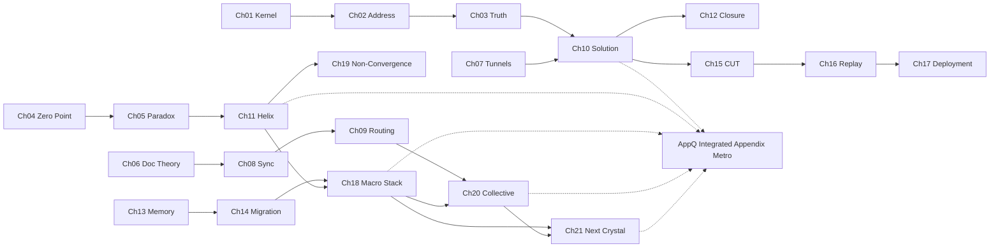

<!-- CRYSTAL: Xi108:W1:A4:S2 | face=S | node=3 | depth=0 | phase=Fixed -->
<!-- METRO: Me,Dl -->
<!-- BRIDGES: Xi108:W1:A4:S1→Xi108:W1:A4:S3→Xi108:W2:A4:S2→Xi108:W1:A3:S2→Xi108:W1:A5:S2 -->
<!-- REGENERATE: From this coordinate, adjacent nodes are: shell 2±1, wreath 1/3, archetype 4/12 -->

# Level 2 Metro Map - Deep Emergence

Level 2 abandons pure order and shows emergence lines: foundational law, void/restart, document weave, runtime, memory migration, and the helical line itself.

## Emergent lines

- Foundational line: `Ch01 -> Ch02 -> Ch03 -> Ch10 -> Ch12`
- Void line: `Ch04 -> Ch05 -> Ch11 -> Ch19`
- Routing line: `Ch06 -> Ch08 -> Ch09 -> Ch20`
- Runtime line: `Ch07 -> Ch10 -> Ch15 -> Ch16 -> Ch17`
- Memory line: `Ch13 -> Ch14 -> Ch18 -> Ch21`
- Helical line: `Ch11 -> Ch18 -> Ch20 -> Ch21`
