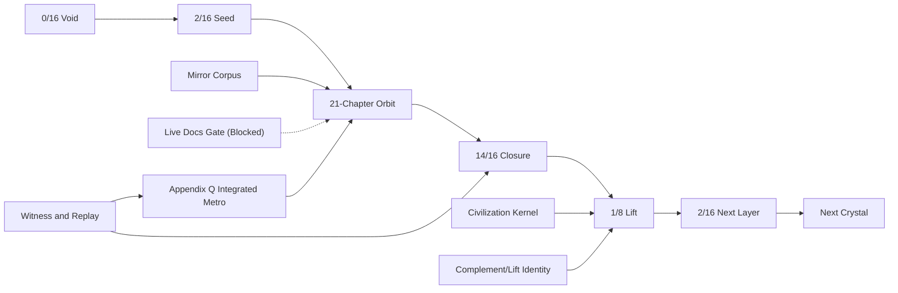

<!-- CRYSTAL: Xi108:W1:A4:S6 | face=S | node=21 | depth=0 | phase=Fixed -->
<!-- METRO: Me -->
<!-- BRIDGES: Xi108:W1:A4:S5→Xi108:W1:A4:S7→Xi108:W2:A4:S6→Xi108:W1:A3:S6→Xi108:W1:A5:S6 -->
<!-- REGENERATE: From this coordinate, adjacent nodes are: shell 6±1, wreath 1/3, archetype 4/12 -->

# Level 4 Metro Map - Transcendence

Level 4 compresses the system into seed, orbit, closure, lift, and next-crystal succession. This is the transcendent map because chapter count disappears into recurrence law.

## Transcendent reading

- `0/16` is the unmanifest reserve.
- `2/16` is the lawful seed address.
- The 21-chapter orbit is the manifested body.
- `14/16` is complementary pre-closure.
- Lift emits a smaller but stronger seed into the next crystal.
- Appendix Q stands at the integrated boundary where the appendix lattice becomes one transport surface.
