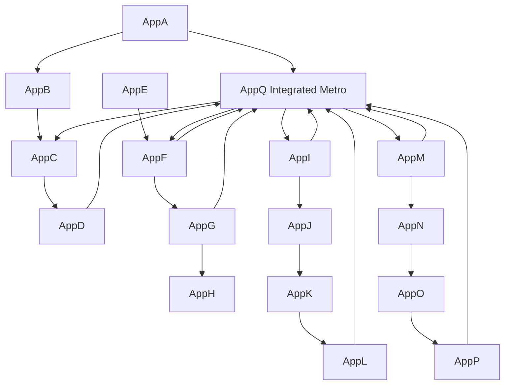

<!-- CRYSTAL: Xi108:W1:A4:S6 | face=S | node=21 | depth=0 | phase=Fixed -->
<!-- METRO: Me -->
<!-- BRIDGES: Xi108:W1:A4:S5→Xi108:W1:A4:S7→Xi108:W2:A4:S6→Xi108:W1:A3:S6→Xi108:W1:A5:S6 -->
<!-- REGENERATE: From this coordinate, adjacent nodes are: shell 6±1, wreath 1/3, archetype 4/12 -->

# Appendix Q - Integrated Appendix-Only Metro Map

Appendix Q is not another appendix topic. It is the metro surface generated when the sixteen appendices are treated as a crystal of governors rather than a tail list of supplements.

## Appendix-only lines

- Parse/kernel line: `AppA -> AppB -> AppC -> AppD`
- Time/transport line: `AppE -> AppF -> AppG -> AppH`
- Truth/evidence line: `AppI -> AppJ -> AppK -> AppL`
- Replay/deployment line: `AppM -> AppN -> AppO -> AppP`
- Integrated crossings: `AppQ <-> AppC`, `AppQ <-> AppF`, `AppQ <-> AppI`, `AppQ <-> AppM`

## Integrated reading

Appendix Q says the appendix lattice is itself a manuscript brain: parse becomes kernel, kernel becomes transport, transport becomes truth, truth becomes replay, and replay becomes deployment. Q is the zero-point hub that lets those bands be read as one system rather than four separate shelves.
