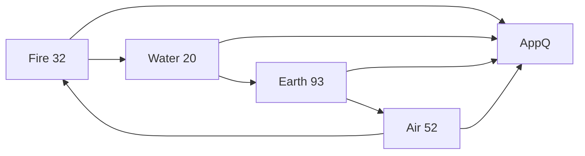

<!-- CRYSTAL: Xi108:W1:A4:S5 | face=S | node=12 | depth=0 | phase=Fixed -->
<!-- METRO: Me -->
<!-- BRIDGES: Xi108:W1:A4:S4→Xi108:W1:A4:S6→Xi108:W2:A4:S5→Xi108:W1:A3:S5→Xi108:W1:A5:S5 -->
<!-- REGENERATE: From this coordinate, adjacent nodes are: shell 5±1, wreath 1/3, archetype 4/12 -->

# Metro Map

Level 1 is the elemental ring.

