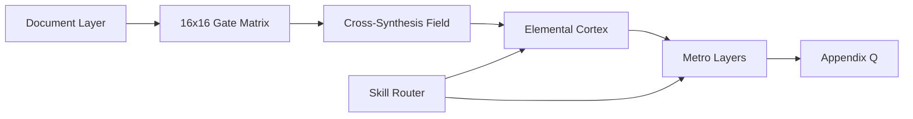

<!-- CRYSTAL: Xi108:W1:A4:S4 | face=S | node=8 | depth=0 | phase=Fixed -->
<!-- METRO: Me -->
<!-- BRIDGES: Xi108:W1:A4:S3→Xi108:W1:A4:S5→Xi108:W2:A4:S4→Xi108:W1:A3:S4→Xi108:W1:A5:S4 -->
<!-- REGENERATE: From this coordinate, adjacent nodes are: shell 4±1, wreath 1/3, archetype 4/12 -->

# Level 3 Metro Map - Deeper Neural Map

