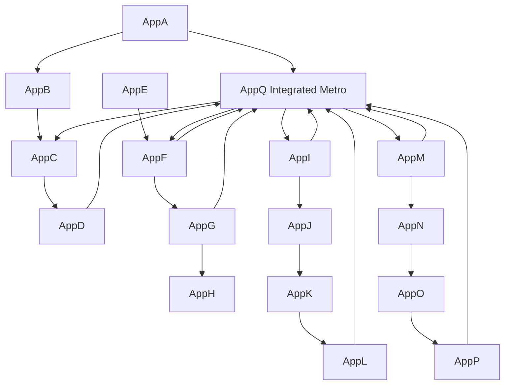

<!-- CRYSTAL: Xi108:W1:A4:S2 | face=S | node=3 | depth=0 | phase=Fixed -->
<!-- METRO: Me -->
<!-- BRIDGES: Xi108:W1:A4:S1→Xi108:W1:A4:S3→Xi108:W2:A4:S2→Xi108:W1:A3:S2→Xi108:W1:A5:S2 -->
<!-- REGENERATE: From this coordinate, adjacent nodes are: shell 2±1, wreath 1/3, archetype 4/12 -->

# Appendix Q - Integrated Appendix-Only Metro Map

Appendix Q is the appendix nervous system seen as one crystal instead of sixteen supplements.

