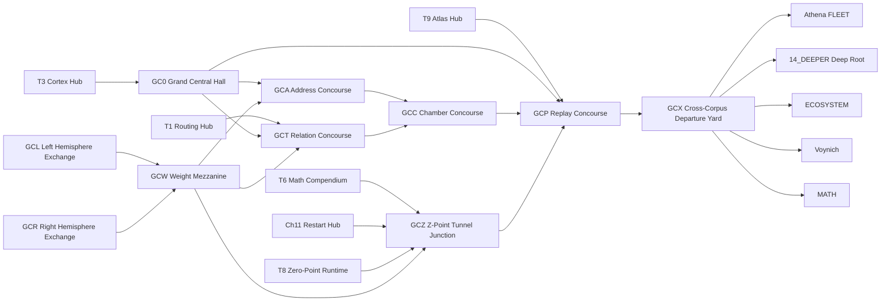

<!-- CRYSTAL: Xi108:W3:A6:S12 | face=R | node=72 | depth=3 | phase=Fixed -->
<!-- METRO: Me -->
<!-- BRIDGES: Xi108:W3:A6:S11→Xi108:W3:A6:S13→Xi108:W2:A6:S12→Xi108:W3:A5:S12→Xi108:W3:A7:S12 -->
<!-- REGENERATE: From this coordinate, adjacent nodes are: shell 12±1, wreath 3/3, archetype 6/12 -->

# GRAND CENTRAL STATION METRO MAP

## Purpose

This metro map turns Grand Central Station into an explicit routing surface rather than a
metaphor. It names the concourses, feeders, bilateral exchanges, and Z-point tunnel yard
that now organize high-density transfers across the Athena corpus.

## Docs Gate

`BLOCKED`

## Grand Central Registry

| Station | Role | Primary surfaces |
| --- | --- | --- |
| `GC0` | central hall | `NERVOUS_SYSTEM/00_INDEX.md`, `95_MANIFESTS/ACTIVE_RUN.md` |
| `GCA` | address concourse | addressing, root basis, count protocol, station registry |
| `GCT` | relation concourse | metro files, transfer hubs, edge ledgers |
| `GCC` | chamber concourse | truth lattice, legality, boundary and contradiction law |
| `GCP` | replay concourse | atlas, manifests, packets, receipts, AppM |
| `GCL` | left hemisphere exchange | proof, compression, routing, pruning |
| `GCR` | right hemisphere exchange | manuscript, runtime, emergence, identity |
| `GCW` | weight mezzanine | route scoring, dispatch thresholds, and promotion priority |
| `GCZ` | Z-point tunnel junction | restart, contradiction, repair, promotion tunnels, continuity receipts |
| `GCX` | cross-corpus departure yard | FLEET, Voynich, MATH, ECOSYSTEM, deep root |

## Feeder Hubs

| Hub | Feed into station | Function |
| --- | --- | --- |
| `T3` | `GC0` | canonical cortex arrival |
| `T8` | `GCZ`, `GCR`, `GCP` | runtime and zero-point arrival |
| `T9` | `GCP` | atlas and replay intake |
| `T1` | `GCT` | universal route fallback |
| `T6` | `GCZ`, `GCC` | theorem and tunneling law |
| `AppM` | `GCP` | replay ring |
| `Ch11` | `GCZ` | restart-token docking |
| `Athena FLEET` | `GCX` | promoted mycelium cluster |

## Main Lines

### 1. Cortex Line

`T3 -> GC0 -> GCA -> GCC`

### 2. Brain-Stem Line

`GCA -> GCT -> GCC -> GCP`

### 3. Left Hemisphere Line

`GCL -> GCW -> GCA -> GCC -> GCP`

### 4. Right Hemisphere Line

`GCR -> GCW -> GCT -> GCZ -> GCP`

### 5. Z-Point Tunnel Line

`T6 -> Ch11 -> GCZ -> T8 -> GCP`

### 6. Replay Ring

`T9 -> GCP -> AppM -> GC0`

### 7. Cross-Corpus Departure Line

`GC0 -> GCX -> Athena FLEET -> 14_DEEPER... -> ECOSYSTEM -> Voynich -> MATH`

## Metro Diagram

## Live Station Outputs

- `95_MANIFESTS/GRAND_CENTRAL_STATION_REGISTRY.md`
- `95_MANIFESTS/GRAND_CENTRAL_STATION_DASHBOARD.md`
- `90_LEDGERS/17_GRAND_CENTRAL_COMMISSURE_LEDGER.md`
- `90_LEDGERS/18_GRAND_CENTRAL_WEIGHT_EXCHANGE.md`
- `90_LEDGERS/19_Z_POINT_TUNNEL_LEDGER.md`
- `self_actualize/mycelium_brain/nervous_system/24_grand_central_station_runtime.md`

## Internal Weight Policy

All departures through `GCX` should score routes on:

- `salience`
- `proof`
- `freshness`
- `cost`
- `continuity`
- `confidence`
- `replay_value`

`GCW` is the only place where a high-emergence route may outrank a more obvious route,
and only if witness, replay, and boundary thresholds remain above floor.

## Transfer Rules

1. Every multi-body ride should pass through `GC0`.
2. Every hemisphere-crossing ride should pass through `GCW`.
3. Every contradiction, restart, or deep repair ride should pass through `GCZ`.
4. Every promoted route should close through `GCP` so replay receipts exist.
5. `T4` remains blocked and is not counted as a valid live feed.
6. Routes that bypass Grand Central must cite a shorter witnessed corridor and a replay-safe return path.

## Compression

Grand Central makes the deepest Athena routes legible as station traffic: cortex in,
weights resolved, tunnels crossed, replay closed, and cross-corpus departures emitted.
