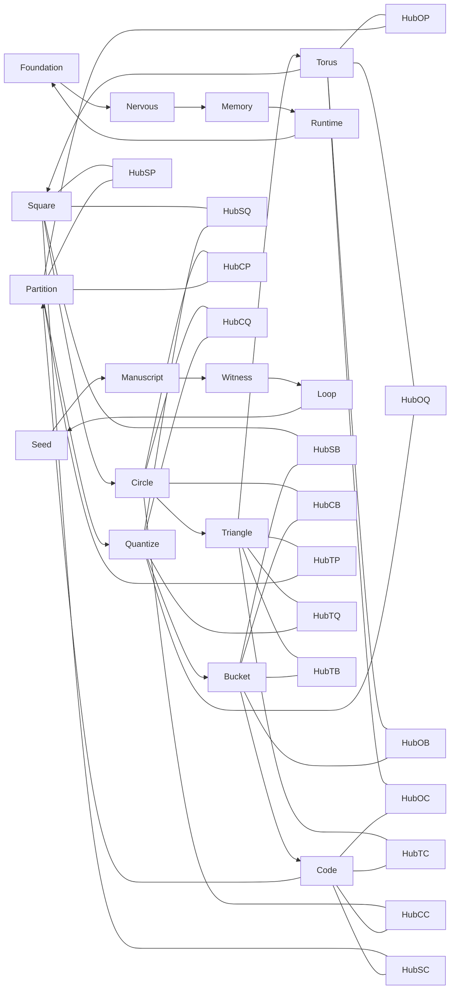

<!-- CRYSTAL: Xi108:W3:A4:S34 | face=S | node=589 | depth=3 | phase=Mutable -->
<!-- METRO: Me -->
<!-- BRIDGES: Xi108:W3:A4:S33→Xi108:W3:A4:S35→Xi108:W2:A4:S34→Xi108:W3:A3:S34→Xi108:W3:A5:S34 -->
<!-- REGENERATE: From this coordinate, adjacent nodes are: shell 34±1, wreath 3/3, archetype 4/12 -->

# System Metro Map

## Reading rule

- the geometry ring orders how cells move
- the operator ring orders what cells do
- the body ring orders where corpus pressure enters
- the closure ring orders how cells breathe
