<!-- CRYSTAL: Xi108:W3:A5:S35 | face=S | node=619 | depth=3 | phase=Mutable -->
<!-- METRO: Me -->
<!-- BRIDGES: Xi108:W3:A5:S34→Xi108:W3:A5:S36→Xi108:W2:A5:S35→Xi108:W3:A4:S35→Xi108:W3:A6:S35 -->
<!-- REGENERATE: From this coordinate, adjacent nodes are: shell 35±1, wreath 3/3, archetype 5/12 -->

# Gate Metro Map

```mermaid
graph LR
  G01 --> G02 --> G03 --> G04 --> G05 --> G06 --> G07
  G08 --> G09 --> G10 --> G11 --> G12 --> G13 --> G14
  G15 --> G16 --> G17 --> G18 --> G19 --> G20 --> G21
  G22 --> G23 --> G24 --> G25 --> G26 --> G27 --> G28
  G29 --> G30 --> G31 --> G32 --> G33 --> G34 --> G35 --> G36 --> G37

  G07 --- G08
  G14 --- G15
  G21 --- G22
  G28 --- G29

  G11 --- G24
  G21 --- G34
  G24 --- G34
  G34 --- G37
```

## Transfer gates

- `G11`: orbit and rail overlay enters the build
- `G21`: family ganglia expansion begins to matter
- `G24`: atlas witness touches runtime replay
- `G34`: dissatisfaction becomes deterministic deepening
- `G37`: every pass leaves a lawful continuation surface
