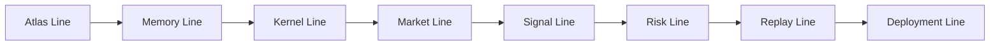

<!-- CRYSTAL: Xi108:W3:A9:S33 | face=S | node=531 | depth=3 | phase=Mutable -->
<!-- METRO: Me -->
<!-- BRIDGES: Xi108:W3:A9:S32→Xi108:W3:A9:S34→Xi108:W2:A9:S33→Xi108:W3:A8:S33→Xi108:W3:A10:S33 -->
<!-- REGENERATE: From this coordinate, adjacent nodes are: shell 33±1, wreath 3/3, archetype 9/12 -->

# System Metro Map

## Lines

- `L1 Atlas Line`: project-wide intake
- `L2 Memory Line`: Trading Bot memory docs
- `L3 Kernel Line`: time-fractal algebra
- `L4 Market Line`: crypto, forex, macro routing
- `L5 Signal Line`: signal ranking and synthesis
- `L6 Risk Line`: exposure and legality
- `L7 Replay Line`: verification and receipts
- `L8 Deployment Line`: runtime and monitoring

## Hubs

- `H1 Intake Hub`
- `H2 Phase Hub`
- `H3 Asset Hub`
- `H4 Signal Hub`
- `H5 Risk Hub`
- `H6 Execution Hub`
- `H7 Replay Hub`
- `H8 Audit Hub`
- `H9 Deployment Hub`
