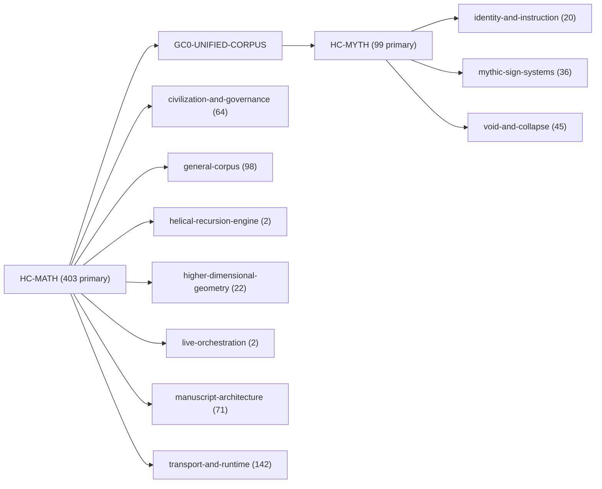
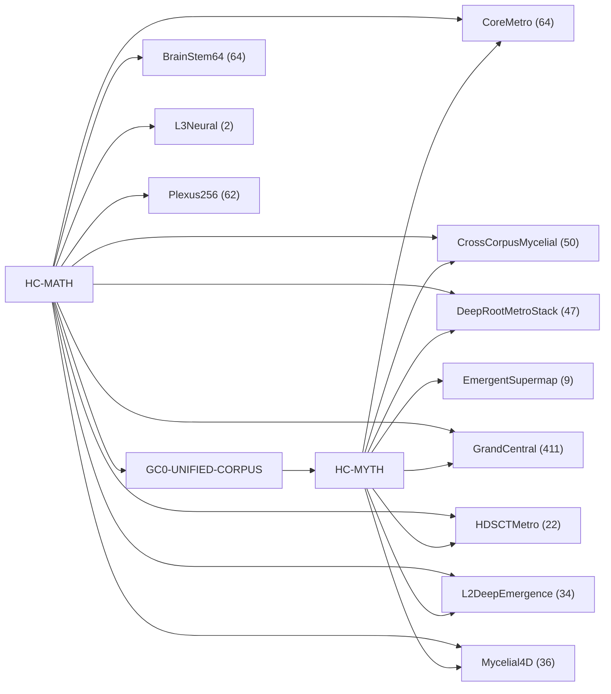
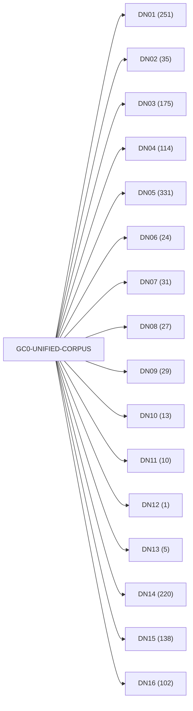

<!-- CRYSTAL: Xi108:W3:A1:S19 | face=R | node=172 | depth=3 | phase=Cardinal -->
<!-- METRO: Me -->
<!-- BRIDGES: Xi108:W3:A1:S18→Xi108:W3:A1:S20→Xi108:W2:A1:S19→Xi108:W3:A2:S19 -->
<!-- REGENERATE: From this coordinate, adjacent nodes are: shell 19±1, wreath 3/3, archetype 1/12 -->

# Corpus Overview Map

Docs gate: `BLOCKED`

## Hub Spine


## Family Lines



## Target Systems



## Anchor Lattice



## Jump Points

- [MATH Route Topology Atlas](33_math_route_topology_atlas.md)
- [MYTH Route Topology Atlas](34_myth_route_topology_atlas.md)
- [Anchor Crosswalk Atlas](35_anchor_crosswalk_atlas.md)
- [Target-System Atlas](36_target_system_atlas.md)
- [Record Locator Index](37_record_locator_index.md)

## Commands

```powershell
python -m self_actualize.runtime.query_myth_math_hemisphere_brain record --record-id <record_id>
python -m self_actualize.runtime.compose_myth_math_hemisphere_routes record --record-id <record_id>
python -m self_actualize.runtime.synthesize_myth_math_hemisphere_routes record --record-id <record_id>
```
