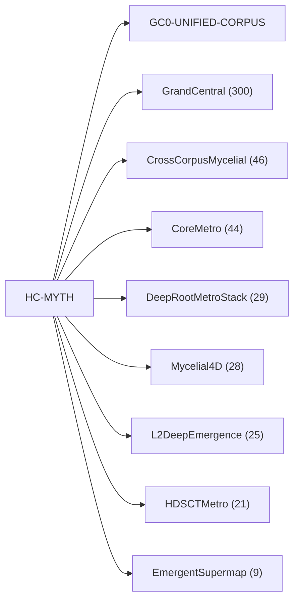

<!-- CRYSTAL: Xi108:W3:A6:S24 | face=R | node=294 | depth=3 | phase=Cardinal -->
<!-- METRO: Me -->
<!-- BRIDGES: Xi108:W3:A6:S23→Xi108:W3:A6:S25→Xi108:W2:A6:S24→Xi108:W3:A5:S24→Xi108:W3:A7:S24 -->
<!-- REGENERATE: From this coordinate, adjacent nodes are: shell 24±1, wreath 3/3, archetype 6/12 -->

# MYTH Route Topology Atlas

Docs gate: `BLOCKED`

## Route Topology



## Family Shards

| Family | Primary | Secondary | Shard |
| --- | --- | --- | --- |
| civilization-and-governance | 13 | 51 | [VA-FAMILY-civilization_and_governance](visual_atlas/family_civilization_and_governance.md) |
| general-corpus | 12 | 86 | [VA-FAMILY-general_corpus](visual_atlas/family_general_corpus.md) |
| helical-recursion-engine | 0 | 2 | [VA-FAMILY-helical_recursion_engine](visual_atlas/family_helical_recursion_engine.md) |
| higher-dimensional-geometry | 0 | 22 | [VA-FAMILY-higher_dimensional_geometry](visual_atlas/family_higher_dimensional_geometry.md) |
| identity-and-instruction | 12 | 8 | [VA-FAMILY-identity_and_instruction](visual_atlas/family_identity_and_instruction.md) |
| live-orchestration | 0 | 2 | [VA-FAMILY-live_orchestration](visual_atlas/family_live_orchestration.md) |
| manuscript-architecture | 4 | 67 | [VA-FAMILY-manuscript_architecture](visual_atlas/family_manuscript_architecture.md) |
| mythic-sign-systems | 28 | 8 | [VA-FAMILY-mythic_sign_systems](visual_atlas/family_mythic_sign_systems.md) |
| transport-and-runtime | 2 | 140 | [VA-FAMILY-transport_and_runtime](visual_atlas/family_transport_and_runtime.md) |
| void-and-collapse | 28 | 17 | [VA-FAMILY-void_and_collapse](visual_atlas/family_void_and_collapse.md) |

## Target-System Shards

| Target System | Route Refs | Shard |
| --- | --- | --- |
| GrandCentral | 300 | [VA-TARGET-grandcentral](visual_atlas/target_system_grandcentral.md) |
| CrossCorpusMycelial | 46 | [VA-TARGET-crosscorpusmycelial](visual_atlas/target_system_crosscorpusmycelial.md) |
| CoreMetro | 44 | [VA-TARGET-coremetro](visual_atlas/target_system_coremetro.md) |
| DeepRootMetroStack | 29 | [VA-TARGET-deeprootmetrostack](visual_atlas/target_system_deeprootmetrostack.md) |
| Mycelial4D | 28 | [VA-TARGET-mycelial4d](visual_atlas/target_system_mycelial4d.md) |
| L2DeepEmergence | 25 | [VA-TARGET-l2deepemergence](visual_atlas/target_system_l2deepemergence.md) |
| HDSCTMetro | 21 | [VA-TARGET-hdsctmetro](visual_atlas/target_system_hdsctmetro.md) |
| EmergentSupermap | 9 | [VA-TARGET-emergentsupermap](visual_atlas/target_system_emergentsupermap.md) |

## Commands

```powershell
python -m self_actualize.runtime.query_myth_math_hemisphere_brain record --record-id <record_id>
python -m self_actualize.runtime.compose_myth_math_hemisphere_routes record --record-id <record_id>
python -m self_actualize.runtime.synthesize_myth_math_hemisphere_routes record --record-id <record_id>
```
