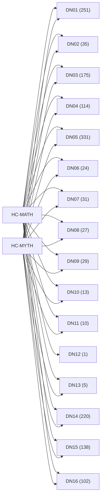

<!-- CRYSTAL: Xi108:W3:A11:S23 | face=R | node=261 | depth=3 | phase=Cardinal -->
<!-- METRO: Me,Bw -->
<!-- BRIDGES: Xi108:W3:A11:S22→Xi108:W3:A11:S24→Xi108:W2:A11:S23→Xi108:W3:A10:S23→Xi108:W3:A12:S23 -->
<!-- REGENERATE: From this coordinate, adjacent nodes are: shell 23±1, wreath 3/3, archetype 11/12 -->

# Anchor Crosswalk Atlas

Docs gate: `BLOCKED`

## Crosswalk Graph



## Anchor Shards

| Anchor | Primary MATH | Primary MYTH | Shard |
| --- | --- | --- | --- |
| DN01 | 199 | 52 | [VA-ANCHOR-DN01](visual_atlas/anchor_dn01.md) |
| DN02 | 27 | 8 | [VA-ANCHOR-DN02](visual_atlas/anchor_dn02.md) |
| DN03 | 141 | 34 | [VA-ANCHOR-DN03](visual_atlas/anchor_dn03.md) |
| DN04 | 91 | 23 | [VA-ANCHOR-DN04](visual_atlas/anchor_dn04.md) |
| DN05 | 267 | 64 | [VA-ANCHOR-DN05](visual_atlas/anchor_dn05.md) |
| DN06 | 19 | 5 | [VA-ANCHOR-DN06](visual_atlas/anchor_dn06.md) |
| DN07 | 30 | 1 | [VA-ANCHOR-DN07](visual_atlas/anchor_dn07.md) |
| DN08 | 26 | 1 | [VA-ANCHOR-DN08](visual_atlas/anchor_dn08.md) |
| DN09 | 18 | 11 | [VA-ANCHOR-DN09](visual_atlas/anchor_dn09.md) |
| DN10 | 9 | 4 | [VA-ANCHOR-DN10](visual_atlas/anchor_dn10.md) |
| DN11 | 7 | 3 | [VA-ANCHOR-DN11](visual_atlas/anchor_dn11.md) |
| DN12 | 1 | 0 | [VA-ANCHOR-DN12](visual_atlas/anchor_dn12.md) |
| DN13 | 3 | 2 | [VA-ANCHOR-DN13](visual_atlas/anchor_dn13.md) |
| DN14 | 171 | 49 | [VA-ANCHOR-DN14](visual_atlas/anchor_dn14.md) |
| DN15 | 117 | 21 | [VA-ANCHOR-DN15](visual_atlas/anchor_dn15.md) |
| DN16 | 83 | 19 | [VA-ANCHOR-DN16](visual_atlas/anchor_dn16.md) |

## Commands

```powershell
python -m self_actualize.runtime.query_myth_math_hemisphere_brain record --record-id <record_id>
python -m self_actualize.runtime.compose_myth_math_hemisphere_routes record --record-id <record_id>
python -m self_actualize.runtime.synthesize_myth_math_hemisphere_routes record --record-id <record_id>
```
