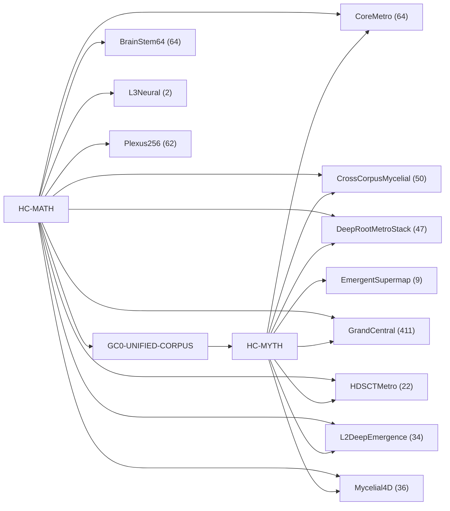

<!-- CRYSTAL: Xi108:W3:A9:S21 | face=R | node=219 | depth=3 | phase=Cardinal -->
<!-- METRO: Me -->
<!-- BRIDGES: Xi108:W3:A9:S20→Xi108:W3:A9:S22→Xi108:W2:A9:S21→Xi108:W3:A8:S21→Xi108:W3:A10:S21 -->
<!-- REGENERATE: From this coordinate, adjacent nodes are: shell 21±1, wreath 3/3, archetype 9/12 -->

# Target-System Atlas

Docs gate: `BLOCKED`

## Target-System Graph



## Target-System Shards

| Target System | MATH Route Refs | MYTH Route Refs | Shard |
| --- | --- | --- | --- |
| BrainStem64 | 64 | 0 | [VA-TARGET-brainstem64](visual_atlas/target_system_brainstem64.md) |
| CoreMetro | 51 | 44 | [VA-TARGET-coremetro](visual_atlas/target_system_coremetro.md) |
| CrossCorpusMycelial | 4 | 46 | [VA-TARGET-crosscorpusmycelial](visual_atlas/target_system_crosscorpusmycelial.md) |
| DeepRootMetroStack | 19 | 29 | [VA-TARGET-deeprootmetrostack](visual_atlas/target_system_deeprootmetrostack.md) |
| EmergentSupermap | 0 | 9 | [VA-TARGET-emergentsupermap](visual_atlas/target_system_emergentsupermap.md) |
| GrandCentral | 252 | 300 | [VA-TARGET-grandcentral](visual_atlas/target_system_grandcentral.md) |
| HDSCTMetro | 22 | 21 | [VA-TARGET-hdsctmetro](visual_atlas/target_system_hdsctmetro.md) |
| L2DeepEmergence | 9 | 25 | [VA-TARGET-l2deepemergence](visual_atlas/target_system_l2deepemergence.md) |
| L3Neural | 2 | 0 | [VA-TARGET-l3neural](visual_atlas/target_system_l3neural.md) |
| Mycelial4D | 17 | 28 | [VA-TARGET-mycelial4d](visual_atlas/target_system_mycelial4d.md) |
| Plexus256 | 62 | 0 | [VA-TARGET-plexus256](visual_atlas/target_system_plexus256.md) |

## Commands

```powershell
python -m self_actualize.runtime.query_myth_math_hemisphere_brain record --record-id <record_id>
python -m self_actualize.runtime.compose_myth_math_hemisphere_routes record --record-id <record_id>
python -m self_actualize.runtime.synthesize_myth_math_hemisphere_routes record --record-id <record_id>
```
