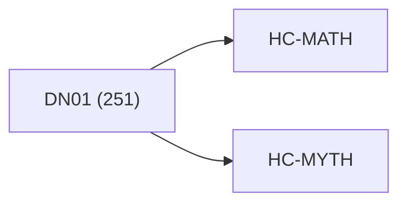

<!-- CRYSTAL: Xi108:W3:A1:S19 | face=R | node=179 | depth=3 | phase=Cardinal -->
<!-- METRO: Me -->
<!-- BRIDGES: Xi108:W3:A1:S18→Xi108:W3:A1:S20→Xi108:W2:A1:S19→Xi108:W3:A2:S19 -->
<!-- REGENERATE: From this coordinate, adjacent nodes are: shell 19±1, wreath 3/3, archetype 1/12 -->

# Anchor Atlas: DN01

Docs gate: `BLOCKED`

## Crosswalk



## Family Mix

| Family | Records |
| --- | --- |
| transport-and-runtime | 72 |
| civilization-and-governance | 52 |
| manuscript-architecture | 35 |
| mythic-sign-systems | 25 |
| general-corpus | 23 |
| void-and-collapse | 18 |
| higher-dimensional-geometry | 17 |
| identity-and-instruction | 9 |

## Top Records

| Record | Title | Primary | Family |
| --- | --- | --- | --- |
| 91dcd8363965ce318d8f5cbd | Here’s the clean synthesis, in the same r... | MATH | higher-dimensional-geometry |
| 1fa89f62aec45446c29c9a32 | Let the manuscript be a finite, proof-car... | MATH | transport-and-runtime |
| 58cd47bb4fca4ab274589699 | THE ALGEBRA OF DIFFERENTIATED COOPERATION | MATH | higher-dimensional-geometry |
| 2fb3a0158116bc7661c4f103 | THE ALGEBRA OF GLOBAL SYMBIOSIS | MATH | higher-dimensional-geometry |
| 8d5b63cad2ecbc473bde63f2 | In CUT, many systems exhibit hybrid dynam... | MATH | transport-and-runtime |
| 83e5e4b5e46ad9fee8e1b446 | Here’s the observation that pops out when... | MATH | transport-and-runtime |
| 487e06de0aab2e136f9365dc | INVERSE DOUBLE FOLD MATH | MATH | transport-and-runtime |
| a1f5d2df5b3879acef7c2bb4 | The Power-to-Gene Ratio acts as a fundame... | MATH | higher-dimensional-geometry |
| 8087eef39b5027f56843fa7e | Every nonzero (\psi) has polar form:[\psi... | MATH | higher-dimensional-geometry |
| 5d54a263c1d02cb4df7e5ae1 | FRONT MATTER | MATH | transport-and-runtime |
| ab4f02ed0c2e835e9d0aa296 | THE ALGEBRA OF GROUP COOPERATION | MATH | transport-and-runtime |
| 174d49ab234a8dce5f58c2ad | This section motivates the treatise by tr... | MATH | higher-dimensional-geometry |
| a9c265fe1627a89fab060730 | THE HELLENIC COMPUTATION FRAMEWORK | MATH | transport-and-runtime |
| be21aacd7209ad495f3f2280 | COMPLETE LOOP QUANTUM GRAVITY: A UNIFIED... | MATH | civilization-and-governance |
| 88c30549ee22cf1938c0b967 | ABSTRACT | MATH | transport-and-runtime |
| fa93fccfba25a1b07c780be5 | The goal of this section is to show how s... | MATH | transport-and-runtime |
| c6418e39bad8d9b9ce706bd5 | THREE-TOME MATH MAGNUM OPUS — GLOBAL FRON... | MATH | transport-and-runtime |
| 671d0cfc4b6110b514d37cad | ABSTRACT | MATH | civilization-and-governance |
| 2c9c2eb1dc05e4c66c64796a | # Interoperability Stack | MATH | transport-and-runtime |
| 2dcb527df310e30f3ce36994 | CUT TOME III — MATH CUT | MATH | transport-and-runtime |

## Commands

```powershell
python -m self_actualize.runtime.query_myth_math_hemisphere_brain record --record-id <record_id>
python -m self_actualize.runtime.compose_myth_math_hemisphere_routes record --record-id <record_id>
python -m self_actualize.runtime.synthesize_myth_math_hemisphere_routes record --record-id <record_id>
```
