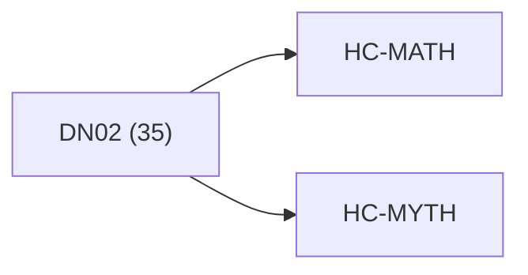

<!-- CRYSTAL: Xi108:W3:A8:S20 | face=R | node=202 | depth=3 | phase=Cardinal -->
<!-- METRO: Me -->
<!-- BRIDGES: Xi108:W3:A8:S19→Xi108:W3:A8:S21→Xi108:W2:A8:S20→Xi108:W3:A7:S20→Xi108:W3:A9:S20 -->
<!-- REGENERATE: From this coordinate, adjacent nodes are: shell 20±1, wreath 3/3, archetype 8/12 -->

# Anchor Atlas: DN02

Docs gate: `BLOCKED`

## Crosswalk



## Family Mix

| Family | Records |
| --- | --- |
| transport-and-runtime | 10 |
| manuscript-architecture | 7 |
| general-corpus | 6 |
| void-and-collapse | 5 |
| civilization-and-governance | 2 |
| mythic-sign-systems | 2 |
| identity-and-instruction | 2 |
| higher-dimensional-geometry | 1 |

## Top Records

| Record | Title | Primary | Family |
| --- | --- | --- | --- |
| 2d9c3c35a95bbebab39b45f6 | Meta-Axiom A2 (Q-Number Definition): A Q-... | MATH | transport-and-runtime |
| c18d3b68e96f40a7fb38ea59 | The resulting Omega–Infinity Framework v2... | MATH | transport-and-runtime |
| 3f4b4cf63d02856ff8482f59 | The Q-Phi AQM Framework is built upon six... | MATH | transport-and-runtime |
| f9b99d6743e886fa3e62d95b | # RECURSIVE EXECUTIVE SELF-OPTIMIZATION F... | MATH | transport-and-runtime |
| 58c3b51f4cfb2432e4a4530e | # Q-PHI UNIFIED FRAMEWORK: 4×5×5 PARALLEL... | MATH | civilization-and-governance |
| 7dce22c3386f3aee3ba9b9e8 | class SimVisionStack(nn.Module): | MATH | higher-dimensional-geometry |
| 6e445c515b6c1df34cfbdf70 | THE QUANTUMVERSE FRAMEWORK (QVF) | MATH | general-corpus |
| 92fdf6d78a4002d05fda6755 | ≈ U_r diag(S_r) Vh_r. We store two factor... | MATH | transport-and-runtime |
| 4ac595cbd2aceb29e22c9f8b | # Synthesis 13 - Self-Reference and Closu... | MATH | civilization-and-governance |
| e818be2fe28dfe592ace66e2 | ║ THE BEST OF ALL WORLDS ║ | MATH | transport-and-runtime |
| b54251ec5d480aaf0e5fba3b | try: | MATH | transport-and-runtime |
| 0b8a8b2a36d054ff4b95c114 | try: | MATH | transport-and-runtime |
| 84e6e4924b35f5c56b4f72c0 | Define for chapter (XX):[\omega:=XX-1,\qu... | MATH | manuscript-architecture |
| ec6c25531d5cb19b71bbcbef | def test_engine_dense_vs_lowrank(): | MATH | general-corpus |
| 3f9c8641e61f9211df9a7e74 | # Synthesis 14 - Cross-Corpus Overburn | MATH | transport-and-runtime |
| 640e1f320a817211e592e445 | # UNIFIED EXTRACTION INDEX | MYTH | general-corpus |
| 375122b42dc57fc473fcd7ed | "ATHENA_OS" | MATH | manuscript-architecture |
| f4c4227287021c4a944c4f3b | # Adaptive QP-GEMM Deployment & Stress-Te... | MATH | transport-and-runtime |
| 18b4041bfbf3052248ed75c7 | PART 1 — ABSTRACT CONTRACT / LEGEND + EXT... | MATH | manuscript-architecture |
| 28078d962d52d43d5294eb32 | Goal: | MATH | void-and-collapse |

## Commands

```powershell
python -m self_actualize.runtime.query_myth_math_hemisphere_brain record --record-id <record_id>
python -m self_actualize.runtime.compose_myth_math_hemisphere_routes record --record-id <record_id>
python -m self_actualize.runtime.synthesize_myth_math_hemisphere_routes record --record-id <record_id>
```
