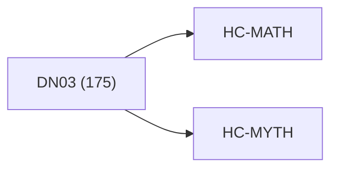

<!-- CRYSTAL: Xi108:W3:A3:S21 | face=R | node=228 | depth=3 | phase=Cardinal -->
<!-- METRO: Me -->
<!-- BRIDGES: Xi108:W3:A3:S20→Xi108:W3:A3:S22→Xi108:W2:A3:S21→Xi108:W3:A2:S21→Xi108:W3:A4:S21 -->
<!-- REGENERATE: From this coordinate, adjacent nodes are: shell 21±1, wreath 3/3, archetype 3/12 -->

# Anchor Atlas: DN03

Docs gate: `BLOCKED`

## Crosswalk



## Family Mix

| Family | Records |
| --- | --- |
| general-corpus | 59 |
| manuscript-architecture | 37 |
| transport-and-runtime | 32 |
| void-and-collapse | 25 |
| identity-and-instruction | 7 |
| civilization-and-governance | 6 |
| mythic-sign-systems | 4 |
| higher-dimensional-geometry | 3 |

## Top Records

| Record | Title | Primary | Family |
| --- | --- | --- | --- |
| ab4f02ed0c2e835e9d0aa296 | THE ALGEBRA OF GROUP COOPERATION | MATH | transport-and-runtime |
| 174d49ab234a8dce5f58c2ad | This section motivates the treatise by tr... | MATH | higher-dimensional-geometry |
| 2c9c2eb1dc05e4c66c64796a | # Interoperability Stack | MATH | transport-and-runtime |
| 2dcb527df310e30f3ce36994 | CUT TOME III — MATH CUT | MATH | transport-and-runtime |
| 0d1ce4b31272804887c36d3f | This treatise is a mathematical productio... | MATH | civilization-and-governance |
| d8c10e166502e76e0bfb263e | # Synthesis 01 - Kernel Recovery | MATH | transport-and-runtime |
| 11361cd9a6aeada3e3f27141 | Z*::MATH.ALPHA+ | MATH | transport-and-runtime |
| d3d7be5b4e7a9a364573a59c | # Synthesis 05 - Lattice, Address, and Ti... | MATH | transport-and-runtime |
| 70bf8eb2ea916dc6c0fb6e07 | All mathematics and computation are model... | MATH | transport-and-runtime |
| 4e95c709735f01d371f7f0df | Definition 1.1.11 (Well-posedness invaria... | MATH | transport-and-runtime |
| ad1bc99338a445dcd001a03b | occur: | MATH | transport-and-runtime |
| 83db0f97e10b7920be6299ad | Canonical structure (Square lens) request... | MATH | transport-and-runtime |
| 58c3b51f4cfb2432e4a4530e | # Q-PHI UNIFIED FRAMEWORK: 4×5×5 PARALLEL... | MATH | civilization-and-governance |
| ada9d4c50e40ae3de02c72ac | Q-SHRINK VOLUME III | MATH | civilization-and-governance |
| b32258f9584684e6904a0387 | Let the tome be a finite, proof-carrying... | MATH | transport-and-runtime |
| f63ce393a7cedafc6b254169 | This script is meant to detect: | MATH | higher-dimensional-geometry |
| 342e7f72198d8d8203aa6944 | Usage: | MATH | transport-and-runtime |
| a8d8ebefe115322681b94d2f | # QP-GEMM Matrix-Multiplication Stress Te... | MATH | transport-and-runtime |
| ffa69c7eaafcdf221098fb0d | # COMPLETE EXTRACTION: IFÁ DIVINATION SYS... | MYTH | mythic-sign-systems |
| 6dc56c7075d79834b651fec3 | The system’s central claim is precise: ev... | MATH | transport-and-runtime |

## Commands

```powershell
python -m self_actualize.runtime.query_myth_math_hemisphere_brain record --record-id <record_id>
python -m self_actualize.runtime.compose_myth_math_hemisphere_routes record --record-id <record_id>
python -m self_actualize.runtime.synthesize_myth_math_hemisphere_routes record --record-id <record_id>
```
