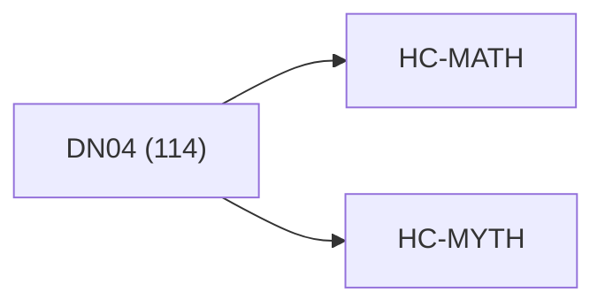

<!-- CRYSTAL: Xi108:W3:A8:S20 | face=R | node=206 | depth=3 | phase=Cardinal -->
<!-- METRO: Me -->
<!-- BRIDGES: Xi108:W3:A8:S19→Xi108:W3:A8:S21→Xi108:W2:A8:S20→Xi108:W3:A7:S20→Xi108:W3:A9:S20 -->
<!-- REGENERATE: From this coordinate, adjacent nodes are: shell 20±1, wreath 3/3, archetype 8/12 -->

# Anchor Atlas: DN04

Docs gate: `BLOCKED`

## Crosswalk



## Family Mix

| Family | Records |
| --- | --- |
| general-corpus | 55 |
| void-and-collapse | 22 |
| transport-and-runtime | 17 |
| manuscript-architecture | 14 |
| identity-and-instruction | 5 |
| mythic-sign-systems | 1 |

## Top Records

| Record | Title | Primary | Family |
| --- | --- | --- | --- |
| 70bf8eb2ea916dc6c0fb6e07 | All mathematics and computation are model... | MATH | transport-and-runtime |
| 83db0f97e10b7920be6299ad | Canonical structure (Square lens) request... | MATH | transport-and-runtime |
| 3d78f260375a805852084ef0 | █ THE BEST OF ALL WORLDS - UNIFIED QUAD-P... | MATH | transport-and-runtime |
| 342e7f72198d8d8203aa6944 | Usage: | MATH | transport-and-runtime |
| a8d8ebefe115322681b94d2f | # QP-GEMM Matrix-Multiplication Stress Te... | MATH | transport-and-runtime |
| 90779984c6846c65a9fbaf57 | aqm_kernel_qphi_planet9_v0.2.2_final | MATH | transport-and-runtime |
| d5f305439e73b9c0519528fa | Rail semantics (normative labels): | MATH | transport-and-runtime |
| 40aa4c0d82407ddbb1bffaa1 | # Synthesis 04 - Transport and Conjugacy | MATH | transport-and-runtime |
| e88e534461562bd46b39af1f | BASE MAPS (NORMATIVE) | MATH | manuscript-architecture |
| 655c7ef5566b1898779b95d3 | Proof-carrying_certificate__one_sample_ro... | MATH | transport-and-runtime |
| 814662a8ff08e433ef9bd7f9 | Integrated_ledger__LBC_operator_words_map... | MATH | transport-and-runtime |
| 602e961beefe5c7f1bdce147 | Unified_planner__Earth_V_Air_routes__oper... | MATH | transport-and-runtime |
| 84e6e4924b35f5c56b4f72c0 | Define for chapter (XX):[\omega:=XX-1,\qu... | MATH | manuscript-architecture |
| 15c6e2bec051fb4d8ae4ad53 | Rails (fully enumerated): | MATH | manuscript-architecture |
| 74c49dcc2f7fc52c85bd987d | Arc (\alpha\in{0,\dots,6}), (\rho=\alpha\... | MATH | manuscript-architecture |
| a5fa8b1384e3907ca82b914e | The Protocol grew out of a series of thou... | MATH | manuscript-architecture |
| 5d357cacf344bb8b2196b664 | Given target atom (v) with lens (L), face... | MATH | manuscript-architecture |
| 04a9b7318c1f11df415a71f4 | unified_framework_file_index | MATH | manuscript-architecture |
| 5099bc833c2190c2ad2c54ba | # Build helper for Windows (PowerShell). | MATH | transport-and-runtime |
| 84d22992e191393578056f82 | PoleStarGEMM is a Quad-Polar (Ψ/Σ/Ω/Δ) op... | MATH | transport-and-runtime |

## Commands

```powershell
python -m self_actualize.runtime.query_myth_math_hemisphere_brain record --record-id <record_id>
python -m self_actualize.runtime.compose_myth_math_hemisphere_routes record --record-id <record_id>
python -m self_actualize.runtime.synthesize_myth_math_hemisphere_routes record --record-id <record_id>
```
