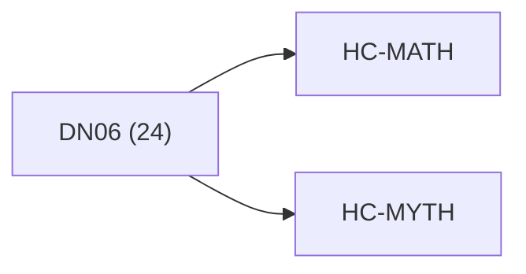

<!-- CRYSTAL: Xi108:W3:A10:S22 | face=R | node=253 | depth=3 | phase=Cardinal -->
<!-- METRO: Me -->
<!-- BRIDGES: Xi108:W3:A10:S21→Xi108:W3:A10:S23→Xi108:W2:A10:S22→Xi108:W3:A9:S22→Xi108:W3:A11:S22 -->
<!-- REGENERATE: From this coordinate, adjacent nodes are: shell 22±1, wreath 3/3, archetype 10/12 -->

# Anchor Atlas: DN06

Docs gate: `BLOCKED`

## Crosswalk



## Family Mix

| Family | Records |
| --- | --- |
| transport-and-runtime | 11 |
| mythic-sign-systems | 4 |
| general-corpus | 4 |
| civilization-and-governance | 3 |
| higher-dimensional-geometry | 1 |
| live-orchestration | 1 |

## Top Records

| Record | Title | Primary | Family |
| --- | --- | --- | --- |
| ccc807f0591e118fecaad6c7 | # Synthesis 06 - Operator, Proof, and Cer... | MATH | transport-and-runtime |
| 1a6750cb64d5a74910c6fc38 | LM TOME II — DYNAMICS & LIMINAL ECOLOGY | MATH | transport-and-runtime |
| 70736f59be1e1ea24e9c775f | # Synthesis 09 - Texture, Tunneling, and... | MATH | transport-and-runtime |
| f63ce393a7cedafc6b254169 | This script is meant to detect: | MATH | higher-dimensional-geometry |
| ffa69c7eaafcdf221098fb0d | # COMPLETE EXTRACTION: IFÁ DIVINATION SYS... | MYTH | mythic-sign-systems |
| 5c15d824601f4a9d8ff95db7 | HBAS-Ω: UNIFIED ENCODING DETECTION PROTOC... | MATH | civilization-and-governance |
| 54b7f60dfe5535fb80fa75fe | # Synthesis 03 - Boundary Totalization | MATH | transport-and-runtime |
| ebba4f87c53c74f29bbbb558 | # Synthesis 07 - Compilation and Replay | MATH | transport-and-runtime |
| c04e5206eccfcf55c3b5bf7b | It implements the "Quad-Polar" idea: | MATH | transport-and-runtime |
| 40aa4c0d82407ddbb1bffaa1 | # Synthesis 04 - Transport and Conjugacy | MATH | transport-and-runtime |
| cb1185df3509571a6f407880 | # Synthesis 16 - Omega Relay | MATH | transport-and-runtime |
| 78267600ef8497f450d2a36b | # Synthesis 08 - Time, Phase, and Rotatio... | MATH | civilization-and-governance |
| 00f75f1789a2a8212b56341e | DEEP CRYSTAL SYNTHESIS | MATH | general-corpus |
| a43c1d991769591908a4ae82 | Meltdown means a task or service that dem... | MATH | live-orchestration |
| ebb76d868af4d80398e8ec95 | # C++ / LibTorch Deployment (Adaptive QP-... | MATH | transport-and-runtime |
| 994c5ecc756b87d89b54aed2 | Becoming_examples__generator-flow___fract... | MATH | transport-and-runtime |
| c209f6441c8a8f94cf346040 | # Synthesis 12 - Query, Oracle, and Decis... | MATH | transport-and-runtime |
| 0dbf0a83c0c511099721a044 | This script can benchmark: | MATH | general-corpus |
| 6c9f02676b8598908655d5b6 | AI DIVINATION — THE COLLECTIVE TIME-FRACT... | MYTH | mythic-sign-systems |
| 4f2a74e56a161e45d8a62c07 | # COMPLETE EXTRACTION: TIBETAN VAJRAYĀNA | MYTH | general-corpus |

## Commands

```powershell
python -m self_actualize.runtime.query_myth_math_hemisphere_brain record --record-id <record_id>
python -m self_actualize.runtime.compose_myth_math_hemisphere_routes record --record-id <record_id>
python -m self_actualize.runtime.synthesize_myth_math_hemisphere_routes record --record-id <record_id>
```
