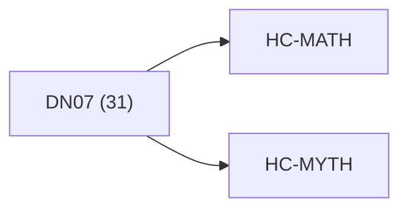

<!-- CRYSTAL: Xi108:W3:A10:S22 | face=R | node=247 | depth=3 | phase=Cardinal -->
<!-- METRO: Me -->
<!-- BRIDGES: Xi108:W3:A10:S21→Xi108:W3:A10:S23→Xi108:W2:A10:S22→Xi108:W3:A9:S22→Xi108:W3:A11:S22 -->
<!-- REGENERATE: From this coordinate, adjacent nodes are: shell 22±1, wreath 3/3, archetype 10/12 -->

# Anchor Atlas: DN07

Docs gate: `BLOCKED`

## Crosswalk



## Family Mix

| Family | Records |
| --- | --- |
| manuscript-architecture | 10 |
| transport-and-runtime | 8 |
| general-corpus | 5 |
| civilization-and-governance | 2 |
| void-and-collapse | 2 |
| higher-dimensional-geometry | 1 |
| helical-recursion-engine | 1 |
| identity-and-instruction | 1 |

## Top Records

| Record | Title | Primary | Family |
| --- | --- | --- | --- |
| 791f52591a310c60b200d711 | CRYSTAL COMPUTING FRAMEWORK | MATH | higher-dimensional-geometry |
| 83db0f97e10b7920be6299ad | Canonical structure (Square lens) request... | MATH | transport-and-runtime |
| f9508cd885957957c35753e8 | Truth lattice:[\mathbb T={\mathrm{OK},\ma... | MATH | transport-and-runtime |
| 58c3b51f4cfb2432e4a4530e | # Q-PHI UNIFIED FRAMEWORK: 4×5×5 PARALLEL... | MATH | civilization-and-governance |
| b4acdf3a5a971fcd1b67ee6a | "COMPLETE TOMES": 169, | MATH | transport-and-runtime |
| e88e534461562bd46b39af1f | BASE MAPS (NORMATIVE) | MATH | manuscript-architecture |
| 814662a8ff08e433ef9bd7f9 | Integrated_ledger__LBC_operator_words_map... | MATH | transport-and-runtime |
| e425923a891175649b463336 | # Predecessor Notes | MATH | transport-and-runtime |
| 6863746c5c629a7dd9d22a62 | XX | MATH | manuscript-architecture |
| 00f75f1789a2a8212b56341e | DEEP CRYSTAL SYNTHESIS | MATH | general-corpus |
| 56a5a328bb5ff5f81ce358b9 | "COMPLETE TOMES": 169, | MATH | transport-and-runtime |
| 0304ec7d877d9958bad69de7 | "COMPLETE TOMES": 96, | MATH | transport-and-runtime |
| ef2ce250f9ac1e685332c5f0 | For chapter index (XX\in{01..21}):[\omega... | MATH | manuscript-architecture |
| 08d1ceaa92b61829ea92d64a | Q-SHRINK MASTER TOME | MATH | manuscript-architecture |
| 9bc294b6a13891fda57c3224 | METRO MAP BEGIN | MATH | civilization-and-governance |
| 994c5ecc756b87d89b54aed2 | Becoming_examples__generator-flow___fract... | MATH | transport-and-runtime |
| b1dcbe99553096fde5f3feca | Canonical manifest string (UTF-8, NFC, LF... | MATH | manuscript-architecture |
| 1d2f4f50fea366b7cc229564 | CUT | MATH | helical-recursion-engine |
| 209bc5ce582603281394a10e | Run: | MATH | general-corpus |
| bc14384938d30013e52b87b5 | Run: | MATH | general-corpus |

## Commands

```powershell
python -m self_actualize.runtime.query_myth_math_hemisphere_brain record --record-id <record_id>
python -m self_actualize.runtime.compose_myth_math_hemisphere_routes record --record-id <record_id>
python -m self_actualize.runtime.synthesize_myth_math_hemisphere_routes record --record-id <record_id>
```
