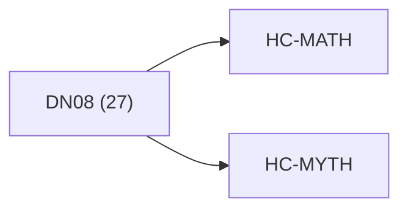

<!-- CRYSTAL: Xi108:W3:A3:S21 | face=R | node=231 | depth=3 | phase=Cardinal -->
<!-- METRO: Me -->
<!-- BRIDGES: Xi108:W3:A3:S20→Xi108:W3:A3:S22→Xi108:W2:A3:S21→Xi108:W3:A2:S21→Xi108:W3:A4:S21 -->
<!-- REGENERATE: From this coordinate, adjacent nodes are: shell 21±1, wreath 3/3, archetype 3/12 -->

# Anchor Atlas: DN08

Docs gate: `BLOCKED`

## Crosswalk



## Family Mix

| Family | Records |
| --- | --- |
| transport-and-runtime | 12 |
| general-corpus | 6 |
| higher-dimensional-geometry | 2 |
| manuscript-architecture | 2 |
| live-orchestration | 2 |
| civilization-and-governance | 1 |
| helical-recursion-engine | 1 |
| mythic-sign-systems | 1 |

## Top Records

| Record | Title | Primary | Family |
| --- | --- | --- | --- |
| 8a7439477e7579036c18d801 | QHC does not claim universal sub-exponent... | MATH | transport-and-runtime |
| 791f52591a310c60b200d711 | CRYSTAL COMPUTING FRAMEWORK | MATH | higher-dimensional-geometry |
| bb794e9e2635bdcca46eccdc | q-Advanced Recursive Self-Improvement (Q-... | MATH | transport-and-runtime |
| 795a6e60473e0d81fdf2be0e | The scope of QHC is not to provide a univ... | MATH | civilization-and-governance |
| eba8219b16ab13f6e1ee1040 | Branch-and-bound is a classic algorithmic... | MATH | transport-and-runtime |
| 52c48c5cf52ae4d06ba32f0f | A topological manifold of dimension (n \i... | MATH | higher-dimensional-geometry |
| 1f652956e0845e7a72b23fcc | The intended reader already works comfort... | MATH | transport-and-runtime |
| 3f4b4cf63d02856ff8482f59 | The Q-Phi AQM Framework is built upon six... | MATH | transport-and-runtime |
| a8d8ebefe115322681b94d2f | # QP-GEMM Matrix-Multiplication Stress Te... | MATH | transport-and-runtime |
| e03f6aaf5d556b8a1960c134 | Q-LEARN | MATH | transport-and-runtime |
| dbbb30fe80d1facf91cf4a6e | Welcome to the comprehensive reference fo... | MATH | transport-and-runtime |
| e88e534461562bd46b39af1f | BASE MAPS (NORMATIVE) | MATH | manuscript-architecture |
| 814662a8ff08e433ef9bd7f9 | Integrated_ledger__LBC_operator_words_map... | MATH | transport-and-runtime |
| 2a6d682e0889b1ecc5b60011 | Always On: HPC tasks typically run 24/7 (... | MATH | live-orchestration |
| a43c1d991769591908a4ae82 | Meltdown means a task or service that dem... | MATH | live-orchestration |
| 67dbe61dcd6e9f0bc689bb8a | #!/usr/bin/env python3 | MATH | general-corpus |
| 142fb14688e1451c1592334c | # Synthesis 02 - State Value Deepening | MATH | helical-recursion-engine |
| 8f9aafacd84c3125361150ea | Let the tome be a finite, proof-carrying... | MATH | manuscript-architecture |
| adf1a41c3c8762206020b4b1 | # Torch sets important compiler flags (in... | MATH | transport-and-runtime |
| 4c8fd86b773c7bbbfa29c486 | # Torch sets important compiler flags (in... | MATH | transport-and-runtime |

## Commands

```powershell
python -m self_actualize.runtime.query_myth_math_hemisphere_brain record --record-id <record_id>
python -m self_actualize.runtime.compose_myth_math_hemisphere_routes record --record-id <record_id>
python -m self_actualize.runtime.synthesize_myth_math_hemisphere_routes record --record-id <record_id>
```
