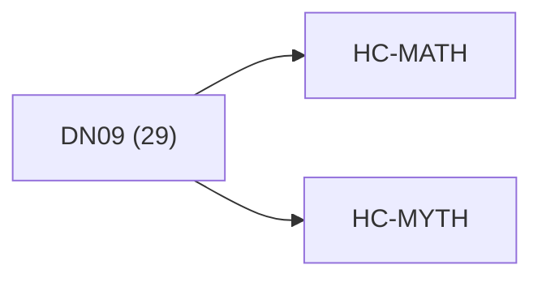

<!-- CRYSTAL: Xi108:W3:A1:S19 | face=R | node=175 | depth=3 | phase=Cardinal -->
<!-- METRO: Me -->
<!-- BRIDGES: Xi108:W3:A1:S18→Xi108:W3:A1:S20→Xi108:W2:A1:S19→Xi108:W3:A2:S19 -->
<!-- REGENERATE: From this coordinate, adjacent nodes are: shell 19±1, wreath 3/3, archetype 1/12 -->

# Anchor Atlas: DN09

Docs gate: `BLOCKED`

## Crosswalk



## Family Mix

| Family | Records |
| --- | --- |
| void-and-collapse | 11 |
| general-corpus | 10 |
| transport-and-runtime | 5 |
| mythic-sign-systems | 2 |
| higher-dimensional-geometry | 1 |

## Top Records

| Record | Title | Primary | Family |
| --- | --- | --- | --- |
| 11361cd9a6aeada3e3f27141 | Z*::MATH.ALPHA+ | MATH | transport-and-runtime |
| f63ce393a7cedafc6b254169 | This script is meant to detect: | MATH | higher-dimensional-geometry |
| 342e7f72198d8d8203aa6944 | Usage: | MATH | transport-and-runtime |
| e685629a1b4a1562aeaa3d3a | ABSTRACT | MATH | void-and-collapse |
| adf1a41c3c8762206020b4b1 | # Torch sets important compiler flags (in... | MATH | transport-and-runtime |
| 4c8fd86b773c7bbbfa29c486 | # Torch sets important compiler flags (in... | MATH | transport-and-runtime |
| 7c8a8309a421b5f516a8a13d | __init__ | MATH | general-corpus |
| 0dbf0a83c0c511099721a044 | This script can benchmark: | MATH | general-corpus |
| 54ca908df201f289a10c704b | #!/usr/bin/env python3 | MATH | general-corpus |
| 4f5a995b9544a70956476e45 | Lens-Becoming_Compiler__tunnel_words___co... | MATH | transport-and-runtime |
| 4882a15188c1b619808db17d | # ZERO POINT AND CORE THESIS | MYTH | mythic-sign-systems |
| c0378549e496eda9212b6e72 | def test_exact_matches_blas(): | MATH | general-corpus |
| 199e5798f733f2f9b3a7cf4e | 𝕋 = {OK, NEAR, AMBIG, FAIL} | MATH | mythic-sign-systems |
| 3ca123043f32066b200b4aee | Aether_Compiler__ABEL_Koenigs_chart_certi... | MATH | general-corpus |
| 87a2798576ba703ebee35842 | Aether_Compiler_cert__a_1_3__fractional_t... | MATH | general-corpus |
| b47d86142fe6b4d27b1f04ab | Earth_Air__probability___corridor__Fire_A... | MATH | general-corpus |
| 0da7c1e3986f85a4f42fdf8f | Tetration_trajectories_x__n_1__a__x_n__fr... | MATH | general-corpus |
| e399762c717097dc48fbc0d1 | Water_as_motion__gradient_descent_traject... | MATH | general-corpus |
| 6c39c57ff8882ae5caf8f22b | Budgeted_routing__corridor-like_control_o... | MYTH | void-and-collapse |
| 189bf16d987ef17ab06681b7 | 6-face_state_space__elements____adjacenci... | MYTH | void-and-collapse |

## Commands

```powershell
python -m self_actualize.runtime.query_myth_math_hemisphere_brain record --record-id <record_id>
python -m self_actualize.runtime.compose_myth_math_hemisphere_routes record --record-id <record_id>
python -m self_actualize.runtime.synthesize_myth_math_hemisphere_routes record --record-id <record_id>
```
