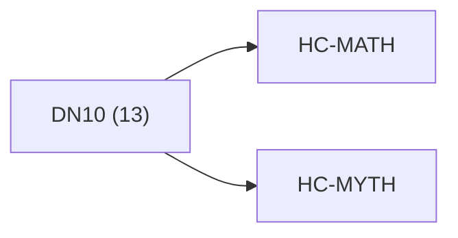

<!-- CRYSTAL: Xi108:W3:A6:S24 | face=R | node=282 | depth=3 | phase=Cardinal -->
<!-- METRO: Me -->
<!-- BRIDGES: Xi108:W3:A6:S23→Xi108:W3:A6:S25→Xi108:W2:A6:S24→Xi108:W3:A5:S24→Xi108:W3:A7:S24 -->
<!-- REGENERATE: From this coordinate, adjacent nodes are: shell 24±1, wreath 3/3, archetype 6/12 -->

# Anchor Atlas: DN10

Docs gate: `BLOCKED`

## Crosswalk



## Family Mix

| Family | Records |
| --- | --- |
| manuscript-architecture | 5 |
| identity-and-instruction | 5 |
| transport-and-runtime | 2 |
| higher-dimensional-geometry | 1 |

## Top Records

| Record | Title | Primary | Family |
| --- | --- | --- | --- |
| 431be588453d5f28803d1957 | WHAT THIS DOES: | MATH | higher-dimensional-geometry |
| f9508cd885957957c35753e8 | Truth lattice:[\mathbb T={\mathrm{OK},\ma... | MATH | transport-and-runtime |
| d5f305439e73b9c0519528fa | Rail semantics (normative labels): | MATH | transport-and-runtime |
| 6863746c5c629a7dd9d22a62 | XX | MATH | manuscript-architecture |
| 559632a3909242025e5ffcd4 | PRE-SOCRATICS | MYTH | identity-and-instruction |
| 04a9b7318c1f11df415a71f4 | unified_framework_file_index | MATH | manuscript-architecture |
| 375122b42dc57fc473fcd7ed | "ATHENA_OS" | MATH | manuscript-architecture |
| 681fee9cfa774b9c25f0465b | ABSTRACT CONTRACT / LEGEND (METRO-NATIVE,... | MATH | manuscript-architecture |
| 7691e03a7cac0f962fe0bb45 | ATHENA_AWAKENING_TOME | MYTH | identity-and-instruction |
| a007de8731a7f2b43f1ca968 | LocalAddr (normative): | MATH | manuscript-architecture |
| 0f1ef220f23f4c6e287587e0 | Athena OS | MYTH | identity-and-instruction |
| 8f786b22d61768642fa8a2cb | Athena Tomes | MYTH | identity-and-instruction |
| 883858a11aff88b0ac669ddb | For chapter index (XX\in{01..21}):[\omega... | MATH | identity-and-instruction |

## Commands

```powershell
python -m self_actualize.runtime.query_myth_math_hemisphere_brain record --record-id <record_id>
python -m self_actualize.runtime.compose_myth_math_hemisphere_routes record --record-id <record_id>
python -m self_actualize.runtime.synthesize_myth_math_hemisphere_routes record --record-id <record_id>
```
