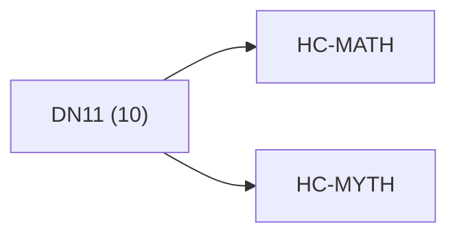

<!-- CRYSTAL: Xi108:W3:A8:S20 | face=R | node=198 | depth=3 | phase=Cardinal -->
<!-- METRO: Me -->
<!-- BRIDGES: Xi108:W3:A8:S19→Xi108:W3:A8:S21→Xi108:W2:A8:S20→Xi108:W3:A7:S20→Xi108:W3:A9:S20 -->
<!-- REGENERATE: From this coordinate, adjacent nodes are: shell 20±1, wreath 3/3, archetype 8/12 -->

# Anchor Atlas: DN11

Docs gate: `BLOCKED`

## Crosswalk



## Family Mix

| Family | Records |
| --- | --- |
| manuscript-architecture | 4 |
| identity-and-instruction | 2 |
| transport-and-runtime | 2 |
| general-corpus | 2 |

## Top Records

| Record | Title | Primary | Family |
| --- | --- | --- | --- |
| 15c6e2bec051fb4d8ae4ad53 | Rails (fully enumerated): | MATH | manuscript-architecture |
| 87a317c561efb26cb804cf26 | VOYNICH EVA CLEAN | MYTH | identity-and-instruction |
| ef2ce250f9ac1e685332c5f0 | For chapter index (XX\in{01..21}):[\omega... | MATH | manuscript-architecture |
| 5d357cacf344bb8b2196b664 | Given target atom (v) with lens (L), face... | MATH | manuscript-architecture |
| adf1a41c3c8762206020b4b1 | # Torch sets important compiler flags (in... | MATH | transport-and-runtime |
| 4c8fd86b773c7bbbfa29c486 | # Torch sets important compiler flags (in... | MATH | transport-and-runtime |
| b0e7b25c261ab94d87b21e49 | VOYNICH MANUSCRIPT | MYTH | manuscript-architecture |
| 209bc5ce582603281394a10e | Run: | MATH | general-corpus |
| bc14384938d30013e52b87b5 | Run: | MATH | general-corpus |
| c0bba7dce6c03bc01d23501d | VOYNICHVM TRICOMPILER | MYTH | identity-and-instruction |

## Commands

```powershell
python -m self_actualize.runtime.query_myth_math_hemisphere_brain record --record-id <record_id>
python -m self_actualize.runtime.compose_myth_math_hemisphere_routes record --record-id <record_id>
python -m self_actualize.runtime.synthesize_myth_math_hemisphere_routes record --record-id <record_id>
```
