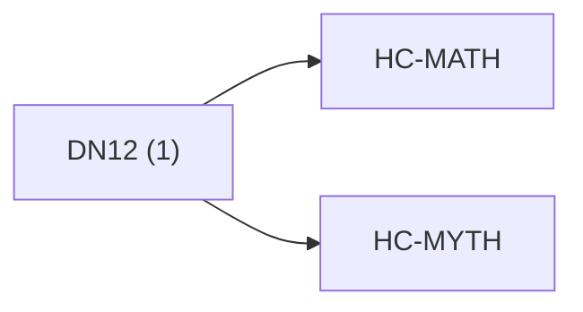

<!-- CRYSTAL: Xi108:W3:A6:S24 | face=R | node=294 | depth=3 | phase=Cardinal -->
<!-- METRO: Me -->
<!-- BRIDGES: Xi108:W3:A6:S23→Xi108:W3:A6:S25→Xi108:W2:A6:S24→Xi108:W3:A5:S24→Xi108:W3:A7:S24 -->
<!-- REGENERATE: From this coordinate, adjacent nodes are: shell 24±1, wreath 3/3, archetype 6/12 -->

# Anchor Atlas: DN12

Docs gate: `BLOCKED`

## Crosswalk



## Family Mix

| Family | Records |
| --- | --- |
| mythic-sign-systems | 1 |

## Top Records

| Record | Title | Primary | Family |
| --- | --- | --- | --- |
| 2e868ffb45b2e09b7fc01a55 | # COMPLETE CATALOG OF ESOTERIC FRAMEWORKS | MATH | mythic-sign-systems |

## Commands

```powershell
python -m self_actualize.runtime.query_myth_math_hemisphere_brain record --record-id <record_id>
python -m self_actualize.runtime.compose_myth_math_hemisphere_routes record --record-id <record_id>
python -m self_actualize.runtime.synthesize_myth_math_hemisphere_routes record --record-id <record_id>
```
