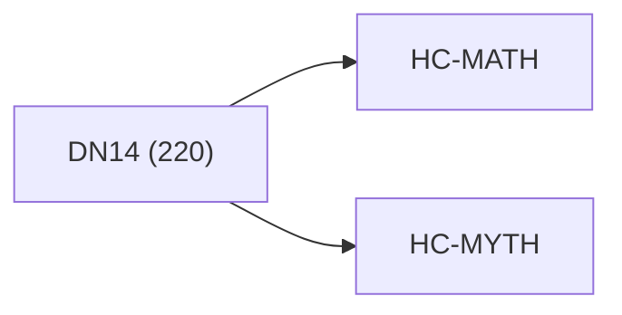

<!-- CRYSTAL: Xi108:W3:A2:S20 | face=R | node=208 | depth=3 | phase=Cardinal -->
<!-- METRO: Me -->
<!-- BRIDGES: Xi108:W3:A2:S19→Xi108:W3:A2:S21→Xi108:W2:A2:S20→Xi108:W3:A1:S20→Xi108:W3:A3:S20 -->
<!-- REGENERATE: From this coordinate, adjacent nodes are: shell 20±1, wreath 3/3, archetype 2/12 -->

# Anchor Atlas: DN14

Docs gate: `BLOCKED`

## Crosswalk



## Family Mix

| Family | Records |
| --- | --- |
| transport-and-runtime | 66 |
| civilization-and-governance | 49 |
| general-corpus | 25 |
| mythic-sign-systems | 23 |
| manuscript-architecture | 21 |
| void-and-collapse | 14 |
| higher-dimensional-geometry | 11 |
| identity-and-instruction | 8 |

## Top Records

| Record | Title | Primary | Family |
| --- | --- | --- | --- |
| 1fa89f62aec45446c29c9a32 | Let the manuscript be a finite, proof-car... | MATH | transport-and-runtime |
| 70cca9bf45b158d13ef92f20 | Dual-boundary jet calculus as the singula... | MATH | transport-and-runtime |
| 58cd47bb4fca4ab274589699 | THE ALGEBRA OF DIFFERENTIATED COOPERATION | MATH | higher-dimensional-geometry |
| 2fb3a0158116bc7661c4f103 | THE ALGEBRA OF GLOBAL SYMBIOSIS | MATH | higher-dimensional-geometry |
| 8b11e855ef7b558d8eca5d1d | (3) Algorithms are channel implementation... | MATH | transport-and-runtime |
| 83e5e4b5e46ad9fee8e1b446 | Here’s the observation that pops out when... | MATH | transport-and-runtime |
| 487e06de0aab2e136f9365dc | INVERSE DOUBLE FOLD MATH | MATH | transport-and-runtime |
| c5d2005d5008152ace9d7988 | MATH FUNDEMENTALS | MATH | transport-and-runtime |
| 23a7af54b5ffc0fbc92d90b3 | AQM TOME V — LIMINAL SPACE (AQM-Λ) | MATH | transport-and-runtime |
| cc2853a91c8df5602c2dfc49 | A minimal list of canonical “undefined” l... | MATH | transport-and-runtime |
| a1f5d2df5b3879acef7c2bb4 | The Power-to-Gene Ratio acts as a fundame... | MATH | higher-dimensional-geometry |
| bb794e9e2635bdcca46eccdc | q-Advanced Recursive Self-Improvement (Q-... | MATH | transport-and-runtime |
| 4d20bff52ff1455842b86a38 | The defining coordinate formula of matrix... | MATH | transport-and-runtime |
| 2d9c3c35a95bbebab39b45f6 | Meta-Axiom A2 (Q-Number Definition): A Q-... | MATH | transport-and-runtime |
| 8087eef39b5027f56843fa7e | Every nonzero (\psi) has polar form:[\psi... | MATH | higher-dimensional-geometry |
| a9c265fe1627a89fab060730 | THE HELLENIC COMPUTATION FRAMEWORK | MATH | transport-and-runtime |
| be21aacd7209ad495f3f2280 | COMPLETE LOOP QUANTUM GRAVITY: A UNIFIED... | MATH | civilization-and-governance |
| 88c30549ee22cf1938c0b967 | ABSTRACT | MATH | transport-and-runtime |
| 3ec73ac6fdc05da4da1039ed | TOME III — THE ENGINE | MATH | transport-and-runtime |
| fa93fccfba25a1b07c780be5 | The goal of this section is to show how s... | MATH | transport-and-runtime |

## Commands

```powershell
python -m self_actualize.runtime.query_myth_math_hemisphere_brain record --record-id <record_id>
python -m self_actualize.runtime.compose_myth_math_hemisphere_routes record --record-id <record_id>
python -m self_actualize.runtime.synthesize_myth_math_hemisphere_routes record --record-id <record_id>
```
