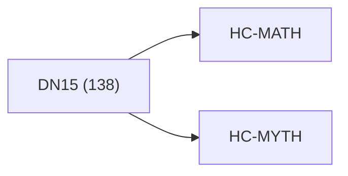

<!-- CRYSTAL: Xi108:W3:A12:S24 | face=R | node=288 | depth=3 | phase=Cardinal -->
<!-- METRO: Me -->
<!-- BRIDGES: Xi108:W3:A12:S23→Xi108:W3:A12:S25→Xi108:W2:A12:S24→Xi108:W3:A11:S24 -->
<!-- REGENERATE: From this coordinate, adjacent nodes are: shell 24±1, wreath 3/3, archetype 12/12 -->

# Anchor Atlas: DN15

Docs gate: `BLOCKED`

## Crosswalk



## Family Mix

| Family | Records |
| --- | --- |
| transport-and-runtime | 54 |
| manuscript-architecture | 23 |
| general-corpus | 20 |
| civilization-and-governance | 12 |
| mythic-sign-systems | 9 |
| higher-dimensional-geometry | 8 |
| void-and-collapse | 6 |
| identity-and-instruction | 5 |

## Top Records

| Record | Title | Primary | Family |
| --- | --- | --- | --- |
| 91dcd8363965ce318d8f5cbd | Here’s the clean synthesis, in the same r... | MATH | higher-dimensional-geometry |
| 1fa89f62aec45446c29c9a32 | Let the manuscript be a finite, proof-car... | MATH | transport-and-runtime |
| ccc807f0591e118fecaad6c7 | # Synthesis 06 - Operator, Proof, and Cer... | MATH | transport-and-runtime |
| 8a7439477e7579036c18d801 | QHC does not claim universal sub-exponent... | MATH | transport-and-runtime |
| 791f52591a310c60b200d711 | CRYSTAL COMPUTING FRAMEWORK | MATH | higher-dimensional-geometry |
| 70cca9bf45b158d13ef92f20 | Dual-boundary jet calculus as the singula... | MATH | transport-and-runtime |
| 8d5b63cad2ecbc473bde63f2 | In CUT, many systems exhibit hybrid dynam... | MATH | transport-and-runtime |
| 8b11e855ef7b558d8eca5d1d | (3) Algorithms are channel implementation... | MATH | transport-and-runtime |
| c5d2005d5008152ace9d7988 | MATH FUNDEMENTALS | MATH | transport-and-runtime |
| 23a7af54b5ffc0fbc92d90b3 | AQM TOME V — LIMINAL SPACE (AQM-Λ) | MATH | transport-and-runtime |
| f38d978a346529d2712a16a9 | THE (N → N+7) TREATISE | MATH | transport-and-runtime |
| cc2853a91c8df5602c2dfc49 | A minimal list of canonical “undefined” l... | MATH | transport-and-runtime |
| 4d20bff52ff1455842b86a38 | The defining coordinate formula of matrix... | MATH | transport-and-runtime |
| 2d9c3c35a95bbebab39b45f6 | Meta-Axiom A2 (Q-Number Definition): A Q-... | MATH | transport-and-runtime |
| 795a6e60473e0d81fdf2be0e | The scope of QHC is not to provide a univ... | MATH | civilization-and-governance |
| 5d54a263c1d02cb4df7e5ae1 | FRONT MATTER | MATH | transport-and-runtime |
| 3ec73ac6fdc05da4da1039ed | TOME III — THE ENGINE | MATH | transport-and-runtime |
| 1a6750cb64d5a74910c6fc38 | LM TOME II — DYNAMICS & LIMINAL ECOLOGY | MATH | transport-and-runtime |
| eba8219b16ab13f6e1ee1040 | Branch-and-bound is a classic algorithmic... | MATH | transport-and-runtime |
| 52c48c5cf52ae4d06ba32f0f | A topological manifold of dimension (n \i... | MATH | higher-dimensional-geometry |

## Commands

```powershell
python -m self_actualize.runtime.query_myth_math_hemisphere_brain record --record-id <record_id>
python -m self_actualize.runtime.compose_myth_math_hemisphere_routes record --record-id <record_id>
python -m self_actualize.runtime.synthesize_myth_math_hemisphere_routes record --record-id <record_id>
```
