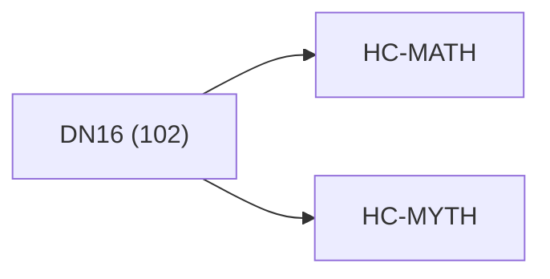

<!-- CRYSTAL: Xi108:W3:A1:S19 | face=R | node=175 | depth=3 | phase=Cardinal -->
<!-- METRO: Me -->
<!-- BRIDGES: Xi108:W3:A1:S18→Xi108:W3:A1:S20→Xi108:W2:A1:S19→Xi108:W3:A2:S19 -->
<!-- REGENERATE: From this coordinate, adjacent nodes are: shell 19±1, wreath 3/3, archetype 1/12 -->

# Anchor Atlas: DN16

Docs gate: `BLOCKED`

## Crosswalk



## Family Mix

| Family | Records |
| --- | --- |
| transport-and-runtime | 44 |
| manuscript-architecture | 19 |
| civilization-and-governance | 11 |
| general-corpus | 10 |
| mythic-sign-systems | 7 |
| higher-dimensional-geometry | 4 |
| identity-and-instruction | 4 |
| void-and-collapse | 3 |

## Top Records

| Record | Title | Primary | Family |
| --- | --- | --- | --- |
| ccc807f0591e118fecaad6c7 | # Synthesis 06 - Operator, Proof, and Cer... | MATH | transport-and-runtime |
| 8a7439477e7579036c18d801 | QHC does not claim universal sub-exponent... | MATH | transport-and-runtime |
| 70cca9bf45b158d13ef92f20 | Dual-boundary jet calculus as the singula... | MATH | transport-and-runtime |
| 8d5b63cad2ecbc473bde63f2 | In CUT, many systems exhibit hybrid dynam... | MATH | transport-and-runtime |
| 8b11e855ef7b558d8eca5d1d | (3) Algorithms are channel implementation... | MATH | transport-and-runtime |
| 23a7af54b5ffc0fbc92d90b3 | AQM TOME V — LIMINAL SPACE (AQM-Λ) | MATH | transport-and-runtime |
| f38d978a346529d2712a16a9 | THE (N → N+7) TREATISE | MATH | transport-and-runtime |
| cc2853a91c8df5602c2dfc49 | A minimal list of canonical “undefined” l... | MATH | transport-and-runtime |
| bb794e9e2635bdcca46eccdc | q-Advanced Recursive Self-Improvement (Q-... | MATH | transport-and-runtime |
| 4d20bff52ff1455842b86a38 | The defining coordinate formula of matrix... | MATH | transport-and-runtime |
| 3ec73ac6fdc05da4da1039ed | TOME III — THE ENGINE | MATH | transport-and-runtime |
| 1a6750cb64d5a74910c6fc38 | LM TOME II — DYNAMICS & LIMINAL ECOLOGY | MATH | transport-and-runtime |
| eba8219b16ab13f6e1ee1040 | Branch-and-bound is a classic algorithmic... | MATH | transport-and-runtime |
| 52c48c5cf52ae4d06ba32f0f | A topological manifold of dimension (n \i... | MATH | higher-dimensional-geometry |
| 1ceb637cd003bc7fd6842b83 | # Core Language Analysis | MATH | transport-and-runtime |
| c18d3b68e96f40a7fb38ea59 | The resulting Omega–Infinity Framework v2... | MATH | transport-and-runtime |
| d3d7be5b4e7a9a364573a59c | # Synthesis 05 - Lattice, Address, and Ti... | MATH | transport-and-runtime |
| 33eb616b7dac86614bc1e38a | LM MASTER TOME — LIMINAL MATHEMATICS (LM) | MATH | transport-and-runtime |
| 5cc08b657dca2506785dae9f | CONTINUOUS-DISCRETE HARMONIC CORRESPONDEN... | MATH | transport-and-runtime |
| bdfe31e438c73514f09c44e9 | # CONTINUOUS-DISCRETE HARMONIC CORRESPOND... | MATH | transport-and-runtime |

## Commands

```powershell
python -m self_actualize.runtime.query_myth_math_hemisphere_brain record --record-id <record_id>
python -m self_actualize.runtime.compose_myth_math_hemisphere_routes record --record-id <record_id>
python -m self_actualize.runtime.synthesize_myth_math_hemisphere_routes record --record-id <record_id>
```
