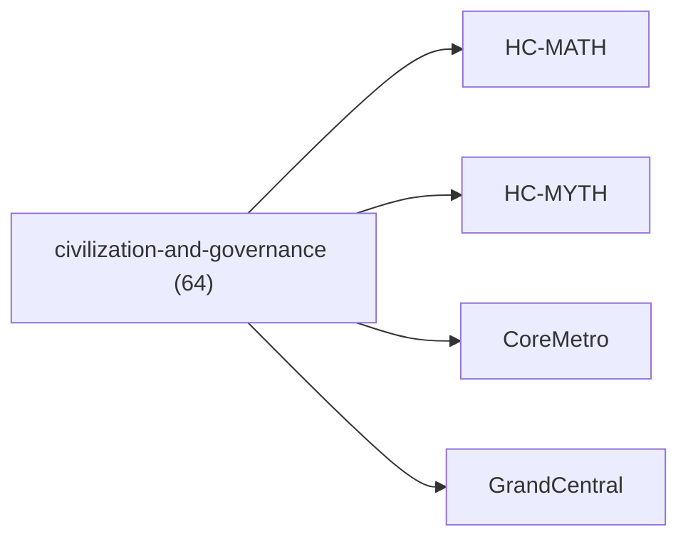

<!-- CRYSTAL: Xi108:W3:A10:S20 | face=R | node=202 | depth=3 | phase=Cardinal -->
<!-- METRO: Me,Cc -->
<!-- BRIDGES: Xi108:W3:A10:S19→Xi108:W3:A10:S21→Xi108:W2:A10:S20→Xi108:W3:A9:S20→Xi108:W3:A11:S20 -->
<!-- REGENERATE: From this coordinate, adjacent nodes are: shell 20±1, wreath 3/3, archetype 10/12 -->

# Family Atlas: civilization-and-governance

Docs gate: `BLOCKED`

## Topology



## Stats

- label: `Civilization design, hierarchy, governance, and law`
- records: `64`
- primary MATH: `51`
- primary MYTH: `13`
- bridge records: `10`
- composer starter groups present: `2`
- synthesis starter groups present: `2`

## Top Records

| Record | Title | Primary | MATH Route | MYTH Route |
| --- | --- | --- | --- | --- |
| 795a6e60473e0d81fdf2be0e | The scope of QHC is not to provide a univ... | MATH | RTE-795a6e60473e0d81fdf2be0e-MATH | RTE-795a6e60473e0d81fdf2be0e-MYTH |
| be21aacd7209ad495f3f2280 | COMPLETE LOOP QUANTUM GRAVITY: A UNIFIED... | MATH | RTE-be21aacd7209ad495f3f2280-MATH | RTE-be21aacd7209ad495f3f2280-MYTH |
| 671d0cfc4b6110b514d37cad | ABSTRACT | MATH | RTE-671d0cfc4b6110b514d37cad-MATH | RTE-671d0cfc4b6110b514d37cad-MYTH |
| 0d1ce4b31272804887c36d3f | This treatise is a mathematical productio... | MATH | RTE-0d1ce4b31272804887c36d3f-MATH | RTE-0d1ce4b31272804887c36d3f-MYTH |
| 0e79646f10fdb6563b5518fe | molecules: | MATH | RTE-0e79646f10fdb6563b5518fe-MATH | RTE-0e79646f10fdb6563b5518fe-MYTH |
| 78591b5ce31fcbe4623cee99 | DAO SU (道數): A COMPENDIUM OF TAOIST COMPU... | MATH | RTE-78591b5ce31fcbe4623cee99-MATH | RTE-78591b5ce31fcbe4623cee99-MYTH |
| 58c3b51f4cfb2432e4a4530e | # Q-PHI UNIFIED FRAMEWORK: 4×5×5 PARALLEL... | MATH | RTE-58c3b51f4cfb2432e4a4530e-MATH | RTE-58c3b51f4cfb2432e4a4530e-MYTH |
| dc94c8444ca0ad103b72d35a | DEEP CROSS-SYNTHESIS: THE UNIFIED PROOF-C... | MATH | RTE-dc94c8444ca0ad103b72d35a-MATH | RTE-dc94c8444ca0ad103b72d35a-MYTH |
| ada9d4c50e40ae3de02c72ac | Q-SHRINK VOLUME III | MATH | RTE-ada9d4c50e40ae3de02c72ac-MATH | RTE-ada9d4c50e40ae3de02c72ac-MYTH |
| 8d5b333f84f7dbbe8a45acc7 | GLOBAL INFORMATION NETWORK | MATH | RTE-8d5b333f84f7dbbe8a45acc7-MATH | RTE-8d5b333f84f7dbbe8a45acc7-MYTH |
| 0351c55f2d28cd2d5eaf22c5 | THE EUCLIDEAN COMPUTATION ENGINE | MATH | RTE-0351c55f2d28cd2d5eaf22c5-MATH | RTE-0351c55f2d28cd2d5eaf22c5-MYTH |
| 737da13b5578cc1b95607c5e | Let (t\in\mathbb{N}) index control ticks.... | MATH | RTE-737da13b5578cc1b95607c5e-MATH | RTE-737da13b5578cc1b95607c5e-MYTH |
| 636423f3cb25d7c7b2347afc | THE POLITEIA KERNEL | MATH | RTE-636423f3cb25d7c7b2347afc-MATH | RTE-636423f3cb25d7c7b2347afc-MYTH |
| 5c15d824601f4a9d8ff95db7 | HBAS-Ω: UNIFIED ENCODING DETECTION PROTOC... | MATH | RTE-5c15d824601f4a9d8ff95db7-MATH | RTE-5c15d824601f4a9d8ff95db7-MYTH |
| cf1f30d748cddaf82c8ef789 | ABSTRACT | MATH | RTE-cf1f30d748cddaf82c8ef789-MATH | RTE-cf1f30d748cddaf82c8ef789-MYTH |
| b55c90a83788755d20da2e27 | Definition 1.1.2.1 (Regimes).A Q-SHRINK p... | MATH | RTE-b55c90a83788755d20da2e27-MATH | RTE-b55c90a83788755d20da2e27-MYTH |
| 2189f9121a067e2d14763b13 | ABSTRACT | MATH | RTE-2189f9121a067e2d14763b13-MATH | RTE-2189f9121a067e2d14763b13-MYTH |
| cb8f11e1625ea6e5d118b3b1 | THE UNIVERSAL COMPUTATIONAL ONTOLOGY (UCO) | MATH | RTE-cb8f11e1625ea6e5d118b3b1-MATH | RTE-cb8f11e1625ea6e5d118b3b1-MYTH |
| a523c58681367557bd3cce3b | Formally, for any query q regarding the s... | MATH | RTE-a523c58681367557bd3cce3b-MATH | RTE-a523c58681367557bd3cce3b-MYTH |
| 893f641b6422d0b0363d6ba7 | HELLENIC COMPUTATION FRAMEWORK (LF-OS) | MATH | RTE-893f641b6422d0b0363d6ba7-MATH | RTE-893f641b6422d0b0363d6ba7-MYTH |

## Commands

```powershell
python -m self_actualize.runtime.query_myth_math_hemisphere_brain facet --family civilization-and-governance
python -m self_actualize.runtime.compose_myth_math_hemisphere_routes facet --family civilization-and-governance
python -m self_actualize.runtime.synthesize_myth_math_hemisphere_routes facet --family civilization-and-governance
```
