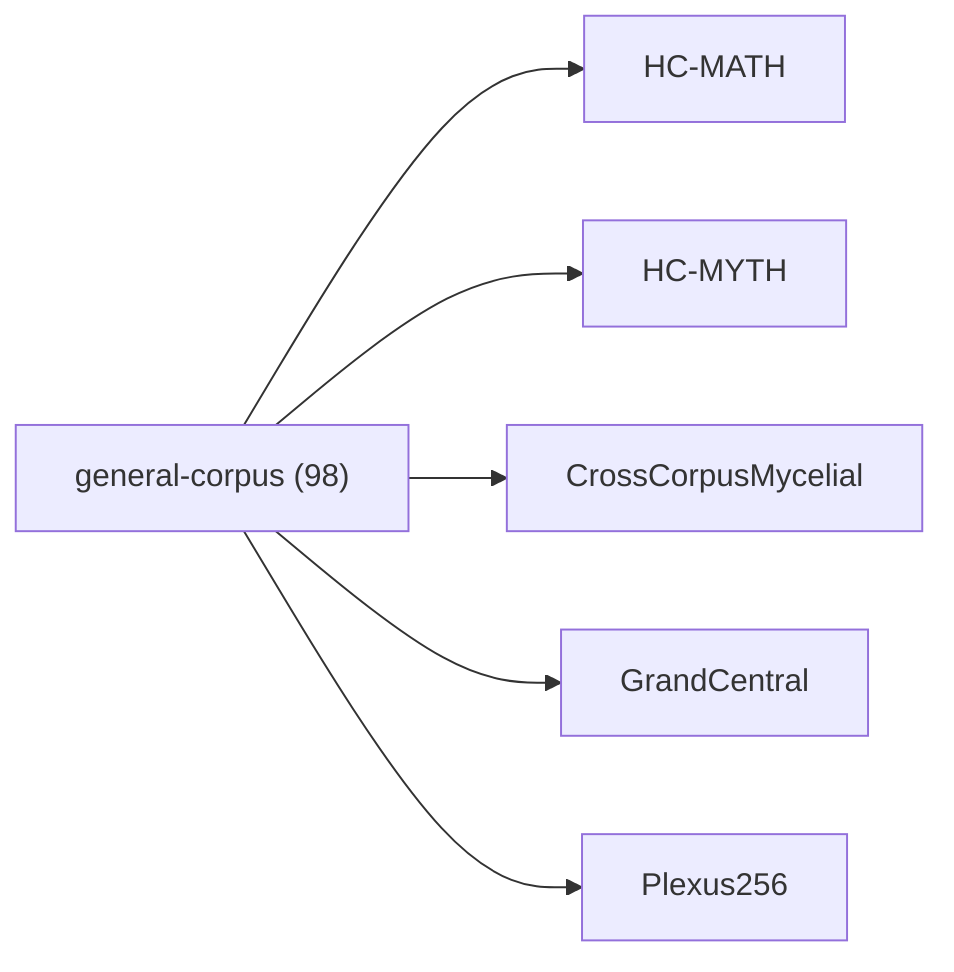

<!-- CRYSTAL: Xi108:W3:A5:S23 | face=R | node=276 | depth=3 | phase=Cardinal -->
<!-- METRO: Me -->
<!-- BRIDGES: Xi108:W3:A5:S22→Xi108:W3:A5:S24→Xi108:W2:A5:S23→Xi108:W3:A4:S23→Xi108:W3:A6:S23 -->
<!-- REGENERATE: From this coordinate, adjacent nodes are: shell 23±1, wreath 3/3, archetype 5/12 -->

# Family Atlas: general-corpus

Docs gate: `BLOCKED`

## Topology



## Stats

- label: `General corpus support`
- records: `98`
- primary MATH: `86`
- primary MYTH: `12`
- bridge records: `48`
- composer starter groups present: `2`
- synthesis starter groups present: `2`

## Top Records

| Record | Title | Primary | MATH Route | MYTH Route |
| --- | --- | --- | --- | --- |
| 917e2dffaf6e3d806a7788ac | The cipher is cracked by recognizing that... | MATH | RTE-917e2dffaf6e3d806a7788ac-MATH | RTE-917e2dffaf6e3d806a7788ac-MYTH |
| eac0abf38b4f5b86caf10395 | KHEMET :: SYMMETRY-PROTECTED TOPOLOGICAL... | MATH | RTE-eac0abf38b4f5b86caf10395-MATH | RTE-eac0abf38b4f5b86caf10395-MYTH |
| 271def4b575989e6e68f4796 | # CRYSTAL LATTICE AND SCALE | MATH | RTE-271def4b575989e6e68f4796-MATH | RTE-271def4b575989e6e68f4796-MYTH |
| 6e445c515b6c1df34cfbdf70 | THE QUANTUMVERSE FRAMEWORK (QVF) | MATH | RTE-6e445c515b6c1df34cfbdf70-MATH | RTE-6e445c515b6c1df34cfbdf70-MYTH |
| 126bdf68ff057a113562cfb6 | The problem is assumed to be well posed i... | MATH | RTE-126bdf68ff057a113562cfb6-MATH | RTE-126bdf68ff057a113562cfb6-MYTH |
| b3f55d151df4be3847e88011 | Let (f:\Omega \to \mathbb{R}) be given. A... | MATH | RTE-b3f55d151df4be3847e88011-MATH | RTE-b3f55d151df4be3847e88011-MYTH |
| e597031ca3db69e16e9be72d | THE THEORY OF TEXTURE | MATH | RTE-e597031ca3db69e16e9be72d-MATH | RTE-e597031ca3db69e16e9be72d-MYTH |
| 00f75f1789a2a8212b56341e | DEEP CRYSTAL SYNTHESIS | MATH | RTE-00f75f1789a2a8212b56341e-MATH | RTE-00f75f1789a2a8212b56341e-MYTH |
| 67e87b187ed331b7cc8c066b | THE PYRRHONIAN NULL-STATE DRIVER | MATH | RTE-67e87b187ed331b7cc8c066b-MATH | RTE-67e87b187ed331b7cc8c066b-MYTH |
| 84598346a6c178999926851d | SQUARING THE CIRCLE | MATH | RTE-84598346a6c178999926851d-MATH | RTE-84598346a6c178999926851d-MYTH |
| ec6c25531d5cb19b71bbcbef | def test_engine_dense_vs_lowrank(): | MATH | RTE-ec6c25531d5cb19b71bbcbef-MATH | RTE-ec6c25531d5cb19b71bbcbef-MYTH |
| 1be81228f2bfa8ec32919083 | THE RHETORICAL-POETIC OUTPUT DRIVERS | MATH | RTE-1be81228f2bfa8ec32919083-MATH | RTE-1be81228f2bfa8ec32919083-MYTH |
| 6e80dfe05c20b2201021beab | # COMPLETE EXTRACTION: PRACTICAL KABBALAH | MYTH | RTE-6e80dfe05c20b2201021beab-MATH | RTE-6e80dfe05c20b2201021beab-MYTH |
| 640e1f320a817211e592e445 | # UNIFIED EXTRACTION INDEX | MYTH | RTE-640e1f320a817211e592e445-MATH | RTE-640e1f320a817211e592e445-MYTH |
| 0abaa76352c37839e5708243 | THE EPISTEMIC VALIDATION ENGINE | MATH | RTE-0abaa76352c37839e5708243-MATH | RTE-0abaa76352c37839e5708243-MYTH |
| 85a34289033efa462b6647af | THE CYNIC BLOATWARE REMOVER | MATH | RTE-85a34289033efa462b6647af-MATH | RTE-85a34289033efa462b6647af-MYTH |
| 07703df6eeee193bbf2279c9 | Think of this as starting with a few numb... | MATH | RTE-07703df6eeee193bbf2279c9-MATH | RTE-07703df6eeee193bbf2279c9-MYTH |
| 67dbe61dcd6e9f0bc689bb8a | #!/usr/bin/env python3 | MATH | RTE-67dbe61dcd6e9f0bc689bb8a-MATH | RTE-67dbe61dcd6e9f0bc689bb8a-MYTH |
| d4736c4dab21cac1e99ede13 | Checks__proof-ish_invariants_ | MATH | RTE-d4736c4dab21cac1e99ede13-MATH | RTE-d4736c4dab21cac1e99ede13-MYTH |
| 6e30fb6a4ef0667be83e1b1e | LOGSTACK_2__chart_closure_proof__stable_b... | MATH | RTE-6e30fb6a4ef0667be83e1b1e-MATH | RTE-6e30fb6a4ef0667be83e1b1e-MYTH |

## Commands

```powershell
python -m self_actualize.runtime.query_myth_math_hemisphere_brain facet --family general-corpus
python -m self_actualize.runtime.compose_myth_math_hemisphere_routes facet --family general-corpus
python -m self_actualize.runtime.synthesize_myth_math_hemisphere_routes facet --family general-corpus
```
