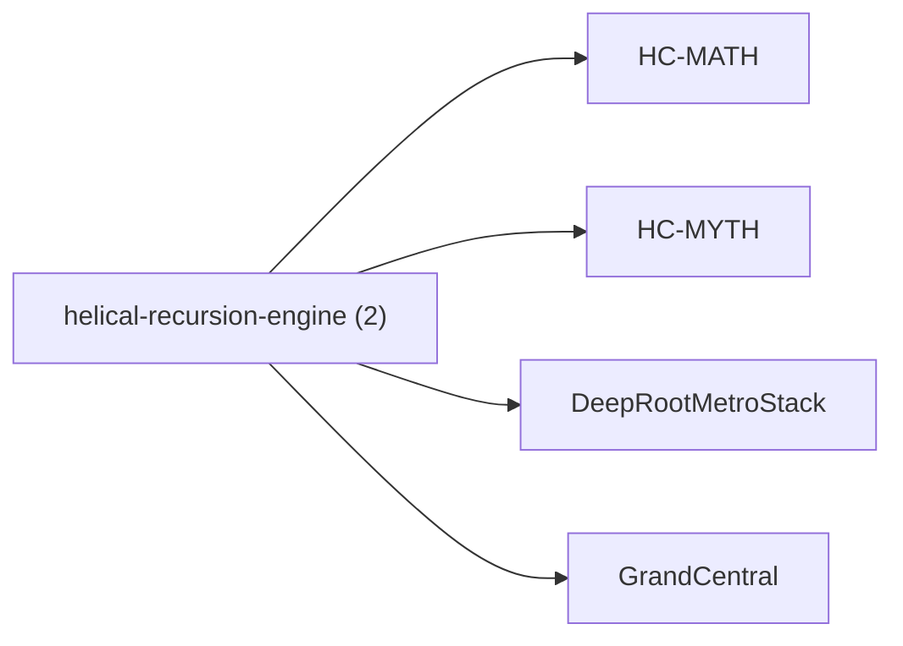

<!-- CRYSTAL: Xi108:W3:A7:S19 | face=R | node=188 | depth=3 | phase=Cardinal -->
<!-- METRO: Me,△ -->
<!-- BRIDGES: Xi108:W3:A7:S18→Xi108:W3:A7:S20→Xi108:W2:A7:S19→Xi108:W3:A6:S19→Xi108:W3:A8:S19 -->
<!-- REGENERATE: From this coordinate, adjacent nodes are: shell 19±1, wreath 3/3, archetype 7/12 -->

# Family Atlas: helical-recursion-engine

Docs gate: `BLOCKED`

## Topology



## Stats

- label: `Helical recursion, lift law, and manifestation engine`
- records: `2`
- primary MATH: `2`
- primary MYTH: `0`
- bridge records: `0`
- composer starter groups present: `0`
- synthesis starter groups present: `0`

## Top Records

| Record | Title | Primary | MATH Route | MYTH Route |
| --- | --- | --- | --- | --- |
| 142fb14688e1451c1592334c | # Synthesis 02 - State Value Deepening | MATH | RTE-142fb14688e1451c1592334c-MATH | RTE-142fb14688e1451c1592334c-MYTH |
| 1d2f4f50fea366b7cc229564 | CUT | MATH | RTE-1d2f4f50fea366b7cc229564-MATH | RTE-1d2f4f50fea366b7cc229564-MYTH |

## Commands

```powershell
python -m self_actualize.runtime.query_myth_math_hemisphere_brain facet --family helical-recursion-engine
python -m self_actualize.runtime.compose_myth_math_hemisphere_routes facet --family helical-recursion-engine
python -m self_actualize.runtime.synthesize_myth_math_hemisphere_routes facet --family helical-recursion-engine
```
