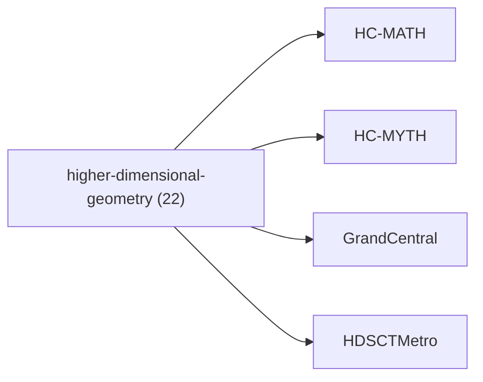

<!-- CRYSTAL: Xi108:W3:A5:S23 | face=R | node=272 | depth=3 | phase=Cardinal -->
<!-- METRO: Sa,Me,Dl -->
<!-- BRIDGES: Xi108:W3:A5:S22→Xi108:W3:A5:S24→Xi108:W2:A5:S23→Xi108:W3:A4:S23→Xi108:W3:A6:S23 -->
<!-- REGENERATE: From this coordinate, adjacent nodes are: shell 23±1, wreath 3/3, archetype 5/12 -->

# Family Atlas: higher-dimensional-geometry

Docs gate: `BLOCKED`

## Topology



## Stats

- label: `Higher-dimensional geometry and holographic kernel`
- records: `22`
- primary MATH: `22`
- primary MYTH: `0`
- bridge records: `0`
- composer starter groups present: `1`
- synthesis starter groups present: `1`

## Top Records

| Record | Title | Primary | MATH Route | MYTH Route |
| --- | --- | --- | --- | --- |
| 91dcd8363965ce318d8f5cbd | Here’s the clean synthesis, in the same r... | MATH | RTE-91dcd8363965ce318d8f5cbd-MATH | RTE-91dcd8363965ce318d8f5cbd-MYTH |
| 791f52591a310c60b200d711 | CRYSTAL COMPUTING FRAMEWORK | MATH | RTE-791f52591a310c60b200d711-MATH | RTE-791f52591a310c60b200d711-MYTH |
| 58cd47bb4fca4ab274589699 | THE ALGEBRA OF DIFFERENTIATED COOPERATION | MATH | RTE-58cd47bb4fca4ab274589699-MATH | RTE-58cd47bb4fca4ab274589699-MYTH |
| 2fb3a0158116bc7661c4f103 | THE ALGEBRA OF GLOBAL SYMBIOSIS | MATH | RTE-2fb3a0158116bc7661c4f103-MATH | RTE-2fb3a0158116bc7661c4f103-MYTH |
| a1f5d2df5b3879acef7c2bb4 | The Power-to-Gene Ratio acts as a fundame... | MATH | RTE-a1f5d2df5b3879acef7c2bb4-MATH | RTE-a1f5d2df5b3879acef7c2bb4-MYTH |
| 8087eef39b5027f56843fa7e | Every nonzero (\psi) has polar form:[\psi... | MATH | RTE-8087eef39b5027f56843fa7e-MATH | RTE-8087eef39b5027f56843fa7e-MYTH |
| 174d49ab234a8dce5f58c2ad | This section motivates the treatise by tr... | MATH | RTE-174d49ab234a8dce5f58c2ad-MATH | RTE-174d49ab234a8dce5f58c2ad-MYTH |
| 52c48c5cf52ae4d06ba32f0f | A topological manifold of dimension (n \i... | MATH | RTE-52c48c5cf52ae4d06ba32f0f-MATH | RTE-52c48c5cf52ae4d06ba32f0f-MYTH |
| be030cd8418b1fb3a347c830 | In applications, (u(t,x)) often represent... | MATH | RTE-be030cd8418b1fb3a347c830-MATH | RTE-be030cd8418b1fb3a347c830-MYTH |
| 68ca1df9d78d72225bafde02 | TREATISE TITLE: TAWANTINSUYU | MATH | RTE-68ca1df9d78d72225bafde02-MATH | RTE-68ca1df9d78d72225bafde02-MYTH |
| a8180fc66bde105fff781a73 | EXTENDED MATHEMATICAL FOUNDATIONS | MATH | RTE-a8180fc66bde105fff781a73-MATH | RTE-a8180fc66bde105fff781a73-MYTH |
| 431be588453d5f28803d1957 | WHAT THIS DOES: | MATH | RTE-431be588453d5f28803d1957-MATH | RTE-431be588453d5f28803d1957-MYTH |
| 75218a5d5c94e493ee59c229 | Let (x\in\mathcal{X}) be a finite signal... | MATH | RTE-75218a5d5c94e493ee59c229-MATH | RTE-75218a5d5c94e493ee59c229-MYTH |
| 6220bdfbbbd996cfab8c8515 | This script answers questions like: | MATH | RTE-6220bdfbbbd996cfab8c8515-MATH | RTE-6220bdfbbbd996cfab8c8515-MYTH |
| 7134bee13e102f517f77610f | # Ch11<0022> - Quantum Spring: Emergent S... | MATH | RTE-7134bee13e102f517f77610f-MATH | RTE-7134bee13e102f517f77610f-MYTH |
| 5a1c435e26b7fac6e5e2cc43 | MATH GOD!! | MATH | RTE-5a1c435e26b7fac6e5e2cc43-MATH | RTE-5a1c435e26b7fac6e5e2cc43-MYTH |
| 7dce22c3386f3aee3ba9b9e8 | class SimVisionStack(nn.Module): | MATH | RTE-7dce22c3386f3aee3ba9b9e8-MATH | RTE-7dce22c3386f3aee3ba9b9e8-MYTH |
| f63ce393a7cedafc6b254169 | This script is meant to detect: | MATH | RTE-f63ce393a7cedafc6b254169-MATH | RTE-f63ce393a7cedafc6b254169-MYTH |
| 05abe8b0a4595276058324f8 | # Abstract And Thesis | MATH | RTE-05abe8b0a4595276058324f8-MATH | RTE-05abe8b0a4595276058324f8-MYTH |
| b04d4b0936e771fdc7e50e0a | ABSTRACT | MATH | RTE-b04d4b0936e771fdc7e50e0a-MATH | RTE-b04d4b0936e771fdc7e50e0a-MYTH |

## Commands

```powershell
python -m self_actualize.runtime.query_myth_math_hemisphere_brain facet --family higher-dimensional-geometry
python -m self_actualize.runtime.compose_myth_math_hemisphere_routes facet --family higher-dimensional-geometry
python -m self_actualize.runtime.synthesize_myth_math_hemisphere_routes facet --family higher-dimensional-geometry
```
