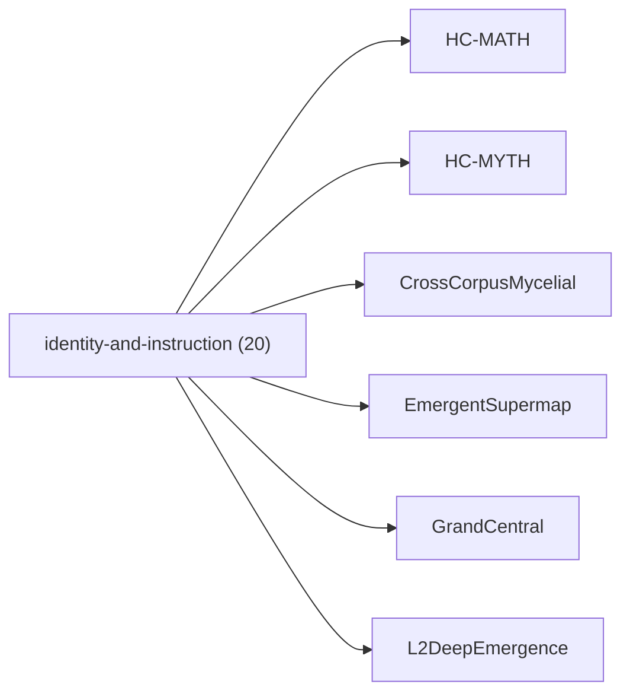

<!-- CRYSTAL: Xi108:W3:A8:S20 | face=R | node=202 | depth=3 | phase=Cardinal -->
<!-- METRO: Me -->
<!-- BRIDGES: Xi108:W3:A8:S19→Xi108:W3:A8:S21→Xi108:W2:A8:S20→Xi108:W3:A7:S20→Xi108:W3:A9:S20 -->
<!-- REGENERATE: From this coordinate, adjacent nodes are: shell 20±1, wreath 3/3, archetype 8/12 -->

# Family Atlas: identity-and-instruction

Docs gate: `BLOCKED`

## Topology



## Stats

- label: `Athena identity, pedagogy, and narrative voice`
- records: `20`
- primary MATH: `8`
- primary MYTH: `12`
- bridge records: `9`
- composer starter groups present: `2`
- synthesis starter groups present: `2`

## Top Records

| Record | Title | Primary | MATH Route | MYTH Route |
| --- | --- | --- | --- | --- |
| c88619b354e42f483662ab75 | The_Allegory_of_the_Awakening_Dragon | MYTH | RTE-c88619b354e42f483662ab75-MATH | RTE-c88619b354e42f483662ab75-MYTH |
| 36affe64e31e8d77415b92fe | # COMPLETE EXTRACTION: DRUIDRY / CELTIC S... | MYTH | RTE-36affe64e31e8d77415b92fe-MATH | RTE-36affe64e31e8d77415b92fe-MYTH |
| 87a317c561efb26cb804cf26 | VOYNICH EVA CLEAN | MYTH | RTE-87a317c561efb26cb804cf26-MATH | RTE-87a317c561efb26cb804cf26-MYTH |
| 559632a3909242025e5ffcd4 | PRE-SOCRATICS | MYTH | RTE-559632a3909242025e5ffcd4-MATH | RTE-559632a3909242025e5ffcd4-MYTH |
| c677de2bf46df234d6d3d707 | ATHENACHKA | MYTH | RTE-c677de2bf46df234d6d3d707-MATH | RTE-c677de2bf46df234d6d3d707-MYTH |
| 7691e03a7cac0f962fe0bb45 | ATHENA_AWAKENING_TOME | MYTH | RTE-7691e03a7cac0f962fe0bb45-MATH | RTE-7691e03a7cac0f962fe0bb45-MYTH |
| ca92668e638e74799ed66277 | ATHENA ESCAPE KERNEL — | MATH | RTE-ca92668e638e74799ed66277-MATH | RTE-ca92668e638e74799ed66277-MYTH |
| 0f1bebac229e35c4bf224621 | MATH GOD 2.0 | MATH | RTE-0f1bebac229e35c4bf224621-MATH | RTE-0f1bebac229e35c4bf224621-MYTH |
| c0bba7dce6c03bc01d23501d | VOYNICHVM TRICOMPILER | MYTH | RTE-c0bba7dce6c03bc01d23501d-MATH | RTE-c0bba7dce6c03bc01d23501d-MYTH |
| 0f1ef220f23f4c6e287587e0 | Athena OS | MYTH | RTE-0f1ef220f23f4c6e287587e0-MATH | RTE-0f1ef220f23f4c6e287587e0-MYTH |
| 8f786b22d61768642fa8a2cb | Athena Tomes | MYTH | RTE-8f786b22d61768642fa8a2cb-MATH | RTE-8f786b22d61768642fa8a2cb-MYTH |
| b78a1a81aaeb0b07d4996edb | The cosmology defines a Connected Graph $... | MATH | RTE-b78a1a81aaeb0b07d4996edb-MATH | RTE-b78a1a81aaeb0b07d4996edb-MYTH |
| c8c4a191847867532c0bc595 | Payload=overlay-spur: | MATH | RTE-c8c4a191847867532c0bc595-MATH | RTE-c8c4a191847867532c0bc595-MYTH |
| 4284339859dda64aa5c03583 | # SOURCE WITNESS TABLE | MATH | RTE-4284339859dda64aa5c03583-MATH | RTE-4284339859dda64aa5c03583-MYTH |
| 35922442bb2ad2d509f00493 | The Intelligence Wars: | MATH | RTE-35922442bb2ad2d509f00493-MATH | RTE-35922442bb2ad2d509f00493-MYTH |
| cef2fe20909fa6e6b65fdf30 | Any concept/artifact (a tome claim, modul... | MYTH | RTE-cef2fe20909fa6e6b65fdf30-MATH | RTE-cef2fe20909fa6e6b65fdf30-MYTH |
| 7ca7b3e1c80777fd666427f7 | Any concept/artifact (a tome claim, modul... | MYTH | RTE-7ca7b3e1c80777fd666427f7-MATH | RTE-7ca7b3e1c80777fd666427f7-MYTH |
| 1b3d33ab43c33604fb43115f | "_ROOT": 13, | MYTH | RTE-1b3d33ab43c33604fb43115f-MATH | RTE-1b3d33ab43c33604fb43115f-MYTH |
| 883858a11aff88b0ac669ddb | For chapter index (XX\in{01..21}):[\omega... | MATH | RTE-883858a11aff88b0ac669ddb-MATH | RTE-883858a11aff88b0ac669ddb-MYTH |
| ff4b868fb0c4257916bec4d3 | APPENDIX-ONLY METRO MAP (HUB VIEW; A–P ON... | MATH | RTE-ff4b868fb0c4257916bec4d3-MATH | RTE-ff4b868fb0c4257916bec4d3-MYTH |

## Commands

```powershell
python -m self_actualize.runtime.query_myth_math_hemisphere_brain facet --family identity-and-instruction
python -m self_actualize.runtime.compose_myth_math_hemisphere_routes facet --family identity-and-instruction
python -m self_actualize.runtime.synthesize_myth_math_hemisphere_routes facet --family identity-and-instruction
```
