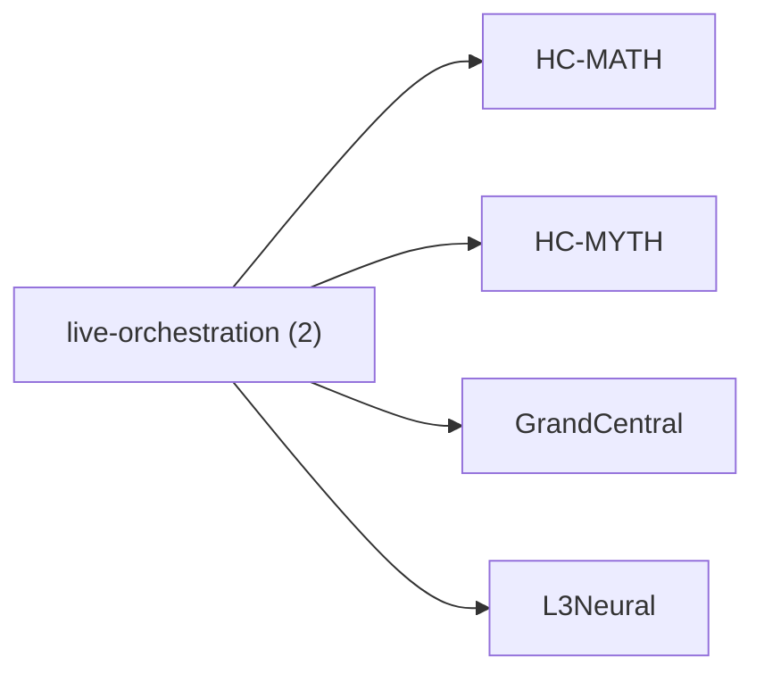

<!-- CRYSTAL: Xi108:W3:A2:S20 | face=R | node=200 | depth=3 | phase=Cardinal -->
<!-- METRO: Me -->
<!-- BRIDGES: Xi108:W3:A2:S19→Xi108:W3:A2:S21→Xi108:W2:A2:S20→Xi108:W3:A1:S20→Xi108:W3:A3:S20 -->
<!-- REGENERATE: From this coordinate, adjacent nodes are: shell 20±1, wreath 3/3, archetype 2/12 -->

# Family Atlas: live-orchestration

Docs gate: `BLOCKED`

## Topology



## Stats

- label: `Live orchestration and prompt control`
- records: `2`
- primary MATH: `2`
- primary MYTH: `0`
- bridge records: `0`
- composer starter groups present: `0`
- synthesis starter groups present: `0`

## Top Records

| Record | Title | Primary | MATH Route | MYTH Route |
| --- | --- | --- | --- | --- |
| 2a6d682e0889b1ecc5b60011 | Always On: HPC tasks typically run 24/7 (... | MATH | RTE-2a6d682e0889b1ecc5b60011-MATH | RTE-2a6d682e0889b1ecc5b60011-MYTH |
| a43c1d991769591908a4ae82 | Meltdown means a task or service that dem... | MATH | RTE-a43c1d991769591908a4ae82-MATH | RTE-a43c1d991769591908a4ae82-MYTH |

## Commands

```powershell
python -m self_actualize.runtime.query_myth_math_hemisphere_brain facet --family live-orchestration
python -m self_actualize.runtime.compose_myth_math_hemisphere_routes facet --family live-orchestration
python -m self_actualize.runtime.synthesize_myth_math_hemisphere_routes facet --family live-orchestration
```
