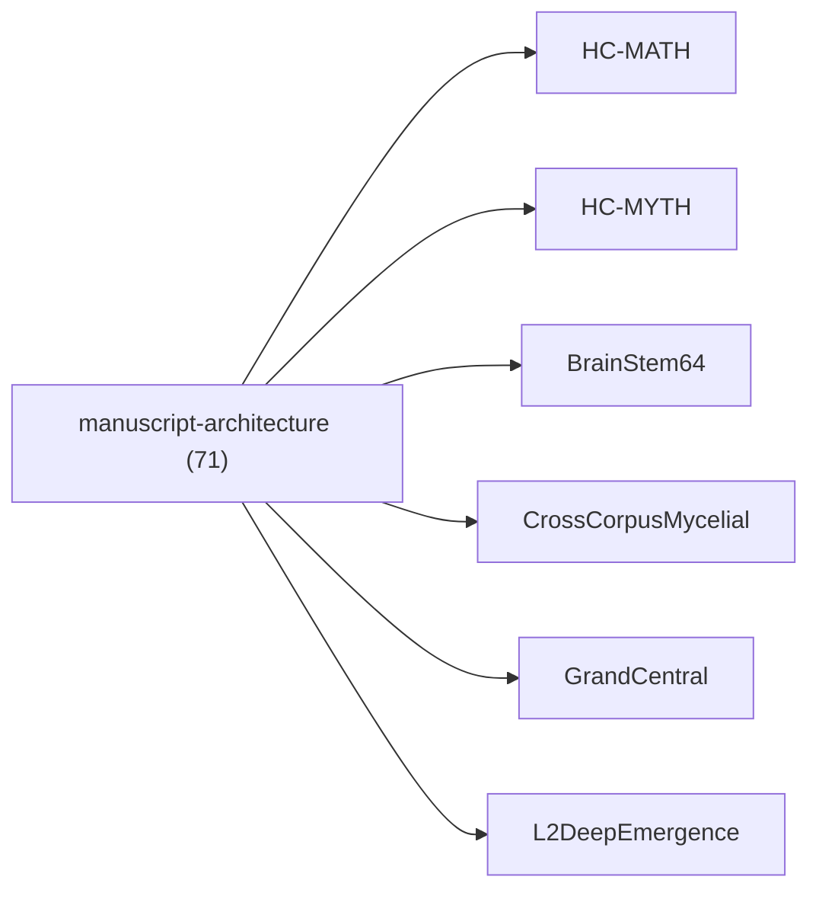

<!-- CRYSTAL: Xi108:W3:A7:S21 | face=R | node=222 | depth=3 | phase=Cardinal -->
<!-- METRO: Me -->
<!-- BRIDGES: Xi108:W3:A7:S20→Xi108:W3:A7:S22→Xi108:W2:A7:S21→Xi108:W3:A6:S21→Xi108:W3:A8:S21 -->
<!-- REGENERATE: From this coordinate, adjacent nodes are: shell 21±1, wreath 3/3, archetype 7/12 -->

# Family Atlas: manuscript-architecture

Docs gate: `BLOCKED`

## Topology



## Stats

- label: `Manuscript architecture and routing law`
- records: `71`
- primary MATH: `67`
- primary MYTH: `4`
- bridge records: `9`
- composer starter groups present: `1`
- synthesis starter groups present: `1`

## Top Records

| Record | Title | Primary | MATH Route | MYTH Route |
| --- | --- | --- | --- | --- |
| a2a80524558fe524a1d4ab20 | Bulk⊕Boundary totalization law. Each such... | MATH | RTE-a2a80524558fe524a1d4ab20-MATH | RTE-a2a80524558fe524a1d4ab20-MYTH |
| 3e52a6e32a4dd7a1013f5bd6 | (C) Holographic Rotation as a representat... | MATH | RTE-3e52a6e32a4dd7a1013f5bd6-MATH | RTE-3e52a6e32a4dd7a1013f5bd6-MYTH |
| 3b41498ef41c47272fa483de | THE ALGEBRA OF SOLAR SYSTEM INTELLIGENCE | MATH | RTE-3b41498ef41c47272fa483de-MATH | RTE-3b41498ef41c47272fa483de-MYTH |
| e9e1c8e4c771fdf15a2ef73d | THE LIMINAL TOWER | MATH | RTE-e9e1c8e4c771fdf15a2ef73d-MATH | RTE-e9e1c8e4c771fdf15a2ef73d-MYTH |
| c8b055cb3668495979f1f114 | To make this precise, the manuscript intr... | MATH | RTE-c8b055cb3668495979f1f114-MATH | RTE-c8b055cb3668495979f1f114-MYTH |
| 2f872be4e38e165d15d33327 | The Master Tome is not a linear narrative... | MATH | RTE-2f872be4e38e165d15d33327-MATH | RTE-2f872be4e38e165d15d33327-MYTH |
| 34f5f4a406e1b1a3899b594d | LM TOME I — FOUNDATIONS & SEMANTICS | MATH | RTE-34f5f4a406e1b1a3899b594d-MATH | RTE-34f5f4a406e1b1a3899b594d-MYTH |
| f1222c323cc5d20b6bd54b77 | LM TOME III — INFORMATION & RENORMALIZATI... | MATH | RTE-f1222c323cc5d20b6bd54b77-MATH | RTE-f1222c323cc5d20b6bd54b77-MYTH |
| fda896096ae74ad71bf9631f | SKELETON OUTLINE: THE $4^4$ CRYSTAL STRUC... | MATH | RTE-fda896096ae74ad71bf9631f-MATH | RTE-fda896096ae74ad71bf9631f-MYTH |
| e9a5891d0d8d8c52c939c623 | At the level of domain instantiations, th... | MATH | RTE-e9a5891d0d8d8c52c939c623-MATH | RTE-e9a5891d0d8d8c52c939c623-MYTH |
| a361c24ad31475727faf40c3 | Classical computational practice conflate... | MATH | RTE-a361c24ad31475727faf40c3-MATH | RTE-a361c24ad31475727faf40c3-MYTH |
| 80e1556b76a5197e6d91fce1 | ABSTRACT | MATH | RTE-80e1556b76a5197e6d91fce1-MATH | RTE-80e1556b76a5197e6d91fce1-MYTH |
| b5b28fc8f0522ae8dcc9b510 | THE FRACTAL CRYSTAL TREATISE | MATH | RTE-b5b28fc8f0522ae8dcc9b510-MATH | RTE-b5b28fc8f0522ae8dcc9b510-MYTH |
| 1476947c4416d75da338d7f3 | This manuscript builds a single, unified... | MATH | RTE-1476947c4416d75da338d7f3-MATH | RTE-1476947c4416d75da338d7f3-MYTH |
| c42cbaf05111068799b2bce3 | # Source Ledger | MATH | RTE-c42cbaf05111068799b2bce3-MATH | RTE-c42cbaf05111068799b2bce3-MYTH |
| 1dcb8dcfea9fc2ab0587e8ad | LM TOME IV — MECHANIZATION & IMPLEMENTATI... | MATH | RTE-1dcb8dcfea9fc2ab0587e8ad-MATH | RTE-1dcb8dcfea9fc2ab0587e8ad-MYTH |
| e88e534461562bd46b39af1f | BASE MAPS (NORMATIVE) | MATH | RTE-e88e534461562bd46b39af1f-MATH | RTE-e88e534461562bd46b39af1f-MYTH |
| 8093ae970d8cbcf0036b4b64 | The total of 256 expressions is derived f... | MATH | RTE-8093ae970d8cbcf0036b4b64-MATH | RTE-8093ae970d8cbcf0036b4b64-MYTH |
| 11133b459e3390f8cb02cff9 | QUANTUMLANG | MATH | RTE-11133b459e3390f8cb02cff9-MATH | RTE-11133b459e3390f8cb02cff9-MYTH |
| aeaff97e03651975d5a6b173 | ABSTRACT CONTRACT / LEGEND | MATH | RTE-aeaff97e03651975d5a6b173-MATH | RTE-aeaff97e03651975d5a6b173-MYTH |

## Commands

```powershell
python -m self_actualize.runtime.query_myth_math_hemisphere_brain facet --family manuscript-architecture
python -m self_actualize.runtime.compose_myth_math_hemisphere_routes facet --family manuscript-architecture
python -m self_actualize.runtime.synthesize_myth_math_hemisphere_routes facet --family manuscript-architecture
```
