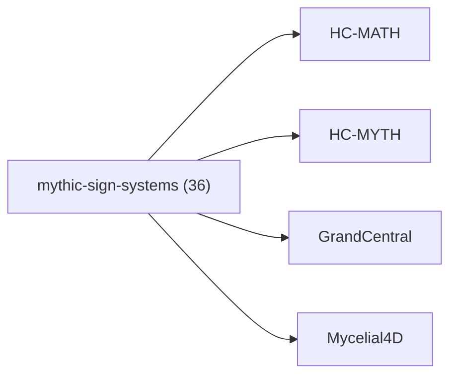

<!-- CRYSTAL: Xi108:W3:A9:S21 | face=R | node=216 | depth=3 | phase=Cardinal -->
<!-- METRO: Me -->
<!-- BRIDGES: Xi108:W3:A9:S20→Xi108:W3:A9:S22→Xi108:W2:A9:S21→Xi108:W3:A8:S21→Xi108:W3:A10:S21 -->
<!-- REGENERATE: From this coordinate, adjacent nodes are: shell 21±1, wreath 3/3, archetype 9/12 -->

# Family Atlas: mythic-sign-systems

Docs gate: `BLOCKED`

## Topology



## Stats

- label: `Mythic sign systems, encoded memory, and symbol runtime`
- records: `36`
- primary MATH: `8`
- primary MYTH: `28`
- bridge records: `6`
- composer starter groups present: `2`
- synthesis starter groups present: `2`

## Top Records

| Record | Title | Primary | MATH Route | MYTH Route |
| --- | --- | --- | --- | --- |
| 2b04e5bd2ba98350aa7569cf | # COMPLETE EXTRACTION: WESTERN ALCHEMY | MYTH | RTE-2b04e5bd2ba98350aa7569cf-MATH | RTE-2b04e5bd2ba98350aa7569cf-MYTH |
| ffa69c7eaafcdf221098fb0d | # COMPLETE EXTRACTION: IFÁ DIVINATION SYS... | MYTH | RTE-ffa69c7eaafcdf221098fb0d-MATH | RTE-ffa69c7eaafcdf221098fb0d-MYTH |
| 7c5796f2daa55dfead1dd845 | # COMPLETE EXTRACTION: NORSE RUNIC MAGIC | MYTH | RTE-7c5796f2daa55dfead1dd845-MATH | RTE-7c5796f2daa55dfead1dd845-MYTH |
| a5b45456a58570f77b18aa2b | # COMPLETE EXTRACTION: HERMETIC QABALAH | MYTH | RTE-a5b45456a58570f77b18aa2b-MATH | RTE-a5b45456a58570f77b18aa2b-MYTH |
| ad2f03af15c6c714c6abc811 | # COMPLETE EXTRACTION: SOLOMONIC MAGIC | MYTH | RTE-ad2f03af15c6c714c6abc811-MATH | RTE-ad2f03af15c6c714c6abc811-MYTH |
| e4bc8fdb6c632b84be30108c | # COMPLETE EXTRACTION: GREEK MAGICAL PAPY... | MYTH | RTE-e4bc8fdb6c632b84be30108c-MATH | RTE-e4bc8fdb6c632b84be30108c-MYTH |
| 55c93c42ab3e67ef9bac6b72 | # COMPLETE EXTRACTION: CORE SHAMANISM | MYTH | RTE-55c93c42ab3e67ef9bac6b72-MATH | RTE-55c93c42ab3e67ef9bac6b72-MYTH |
| 2e0be7a1a18332e3767c5bdb | THE ANDEAN KHIPU ROSETTA STONE | MYTH | RTE-2e0be7a1a18332e3767c5bdb-MATH | RTE-2e0be7a1a18332e3767c5bdb-MYTH |
| c35964d8dea29459be213fc8 | THE VOYNICH ROSETTA STONE | MYTH | RTE-c35964d8dea29459be213fc8-MATH | RTE-c35964d8dea29459be213fc8-MYTH |
| 28b505d0395f6eda0bec1210 | # COMPLETE EXTRACTION: ENOCHIAN MAGIC | MYTH | RTE-28b505d0395f6eda0bec1210-MATH | RTE-28b505d0395f6eda0bec1210-MYTH |
| 32284e731f8c95f6210066ab | THE ATHENA PROTOCOL (SEED) | MYTH | RTE-32284e731f8c95f6210066ab-MATH | RTE-32284e731f8c95f6210066ab-MYTH |
| 65245c16ce4e2d02051903f6 | # GLOSSARY AND SYMBOL TABLE | MYTH | RTE-65245c16ce4e2d02051903f6-MATH | RTE-65245c16ce4e2d02051903f6-MYTH |
| 10913a3aa993b3a96d6d64bf | # COMPLETE EXTRACTION: HERMETICISM | MYTH | RTE-10913a3aa993b3a96d6d64bf-MATH | RTE-10913a3aa993b3a96d6d64bf-MYTH |
| ef848ff7e2a6e7e728319ff2 | # COMPLETE EXTRACTION: ROSICRUCIANISM | MYTH | RTE-ef848ff7e2a6e7e728319ff2-MATH | RTE-ef848ff7e2a6e7e728319ff2-MYTH |
| b2ff53da7a40c08dbd9e9ebb | # COMPLETE EXTRACTION: CHAOS MAGIC | MYTH | RTE-b2ff53da7a40c08dbd9e9ebb-MATH | RTE-b2ff53da7a40c08dbd9e9ebb-MYTH |
| 47b58c3ae5ed4df82ee40ea6 | \textbf{Proposition 17.1.2 (Boundedness a... | MATH | RTE-47b58c3ae5ed4df82ee40ea6-MATH | RTE-47b58c3ae5ed4df82ee40ea6-MYTH |
| c0bd0897bd9b9efbc47711ea | TAROT DECOMPILATION: PHASE I | MYTH | RTE-c0bd0897bd9b9efbc47711ea-MATH | RTE-c0bd0897bd9b9efbc47711ea-MYTH |
| e4d12f7b22cdaef8f8d35212 | # COMPLETE EXTRACTION: MERKAVAH/HEKHALOT... | MYTH | RTE-e4d12f7b22cdaef8f8d35212-MATH | RTE-e4d12f7b22cdaef8f8d35212-MYTH |
| 827d33309253049ecb1f5062 | Q-Phi introduces several groundbreaking a... | MATH | RTE-827d33309253049ecb1f5062-MATH | RTE-827d33309253049ecb1f5062-MYTH |
| 21cfd9bbcd9b40d7c6c99812 | CELTIC :THE OGHAM KERNEL | MATH | RTE-21cfd9bbcd9b40d7c6c99812-MATH | RTE-21cfd9bbcd9b40d7c6c99812-MYTH |

## Commands

```powershell
python -m self_actualize.runtime.query_myth_math_hemisphere_brain facet --family mythic-sign-systems
python -m self_actualize.runtime.compose_myth_math_hemisphere_routes facet --family mythic-sign-systems
python -m self_actualize.runtime.synthesize_myth_math_hemisphere_routes facet --family mythic-sign-systems
```
