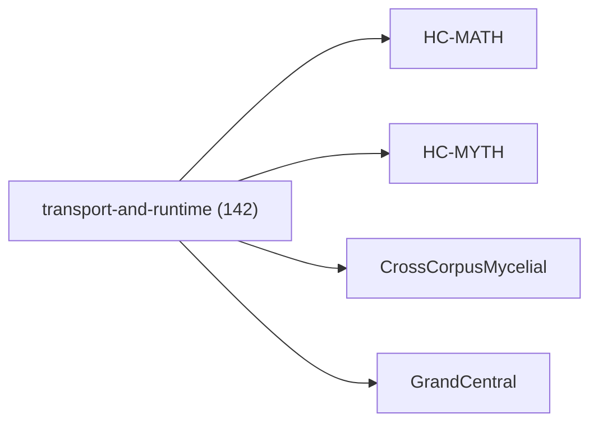

<!-- CRYSTAL: Xi108:W3:A6:S24 | face=R | node=294 | depth=3 | phase=Cardinal -->
<!-- METRO: Me -->
<!-- BRIDGES: Xi108:W3:A6:S23→Xi108:W3:A6:S25→Xi108:W2:A6:S24→Xi108:W3:A5:S24→Xi108:W3:A7:S24 -->
<!-- REGENERATE: From this coordinate, adjacent nodes are: shell 24±1, wreath 3/3, archetype 6/12 -->

# Family Atlas: transport-and-runtime

Docs gate: `BLOCKED`

## Topology



## Stats

- label: `Transport, runtime, and executable framework`
- records: `142`
- primary MATH: `140`
- primary MYTH: `2`
- bridge records: `1`
- composer starter groups present: `2`
- synthesis starter groups present: `2`

## Top Records

| Record | Title | Primary | MATH Route | MYTH Route |
| --- | --- | --- | --- | --- |
| 1fa89f62aec45446c29c9a32 | Let the manuscript be a finite, proof-car... | MATH | RTE-1fa89f62aec45446c29c9a32-MATH | RTE-1fa89f62aec45446c29c9a32-MYTH |
| ccc807f0591e118fecaad6c7 | # Synthesis 06 - Operator, Proof, and Cer... | MATH | RTE-ccc807f0591e118fecaad6c7-MATH | RTE-ccc807f0591e118fecaad6c7-MYTH |
| 8a7439477e7579036c18d801 | QHC does not claim universal sub-exponent... | MATH | RTE-8a7439477e7579036c18d801-MATH | RTE-8a7439477e7579036c18d801-MYTH |
| 70cca9bf45b158d13ef92f20 | Dual-boundary jet calculus as the singula... | MATH | RTE-70cca9bf45b158d13ef92f20-MATH | RTE-70cca9bf45b158d13ef92f20-MYTH |
| 8d5b63cad2ecbc473bde63f2 | In CUT, many systems exhibit hybrid dynam... | MATH | RTE-8d5b63cad2ecbc473bde63f2-MATH | RTE-8d5b63cad2ecbc473bde63f2-MYTH |
| 8b11e855ef7b558d8eca5d1d | (3) Algorithms are channel implementation... | MATH | RTE-8b11e855ef7b558d8eca5d1d-MATH | RTE-8b11e855ef7b558d8eca5d1d-MYTH |
| 83e5e4b5e46ad9fee8e1b446 | Here’s the observation that pops out when... | MATH | RTE-83e5e4b5e46ad9fee8e1b446-MATH | RTE-83e5e4b5e46ad9fee8e1b446-MYTH |
| 487e06de0aab2e136f9365dc | INVERSE DOUBLE FOLD MATH | MATH | RTE-487e06de0aab2e136f9365dc-MATH | RTE-487e06de0aab2e136f9365dc-MYTH |
| c5d2005d5008152ace9d7988 | MATH FUNDEMENTALS | MATH | RTE-c5d2005d5008152ace9d7988-MATH | RTE-c5d2005d5008152ace9d7988-MYTH |
| 23a7af54b5ffc0fbc92d90b3 | AQM TOME V — LIMINAL SPACE (AQM-Λ) | MATH | RTE-23a7af54b5ffc0fbc92d90b3-MATH | RTE-23a7af54b5ffc0fbc92d90b3-MYTH |
| f38d978a346529d2712a16a9 | THE (N → N+7) TREATISE | MATH | RTE-f38d978a346529d2712a16a9-MATH | RTE-f38d978a346529d2712a16a9-MYTH |
| cc2853a91c8df5602c2dfc49 | A minimal list of canonical “undefined” l... | MATH | RTE-cc2853a91c8df5602c2dfc49-MATH | RTE-cc2853a91c8df5602c2dfc49-MYTH |
| bb794e9e2635bdcca46eccdc | q-Advanced Recursive Self-Improvement (Q-... | MATH | RTE-bb794e9e2635bdcca46eccdc-MATH | RTE-bb794e9e2635bdcca46eccdc-MYTH |
| 4d20bff52ff1455842b86a38 | The defining coordinate formula of matrix... | MATH | RTE-4d20bff52ff1455842b86a38-MATH | RTE-4d20bff52ff1455842b86a38-MYTH |
| 2d9c3c35a95bbebab39b45f6 | Meta-Axiom A2 (Q-Number Definition): A Q-... | MATH | RTE-2d9c3c35a95bbebab39b45f6-MATH | RTE-2d9c3c35a95bbebab39b45f6-MYTH |
| 5d54a263c1d02cb4df7e5ae1 | FRONT MATTER | MATH | RTE-5d54a263c1d02cb4df7e5ae1-MATH | RTE-5d54a263c1d02cb4df7e5ae1-MYTH |
| ab4f02ed0c2e835e9d0aa296 | THE ALGEBRA OF GROUP COOPERATION | MATH | RTE-ab4f02ed0c2e835e9d0aa296-MATH | RTE-ab4f02ed0c2e835e9d0aa296-MYTH |
| a9c265fe1627a89fab060730 | THE HELLENIC COMPUTATION FRAMEWORK | MATH | RTE-a9c265fe1627a89fab060730-MATH | RTE-a9c265fe1627a89fab060730-MYTH |
| 88c30549ee22cf1938c0b967 | ABSTRACT | MATH | RTE-88c30549ee22cf1938c0b967-MATH | RTE-88c30549ee22cf1938c0b967-MYTH |
| 3ec73ac6fdc05da4da1039ed | TOME III — THE ENGINE | MATH | RTE-3ec73ac6fdc05da4da1039ed-MATH | RTE-3ec73ac6fdc05da4da1039ed-MYTH |

## Commands

```powershell
python -m self_actualize.runtime.query_myth_math_hemisphere_brain facet --family transport-and-runtime
python -m self_actualize.runtime.compose_myth_math_hemisphere_routes facet --family transport-and-runtime
python -m self_actualize.runtime.synthesize_myth_math_hemisphere_routes facet --family transport-and-runtime
```
