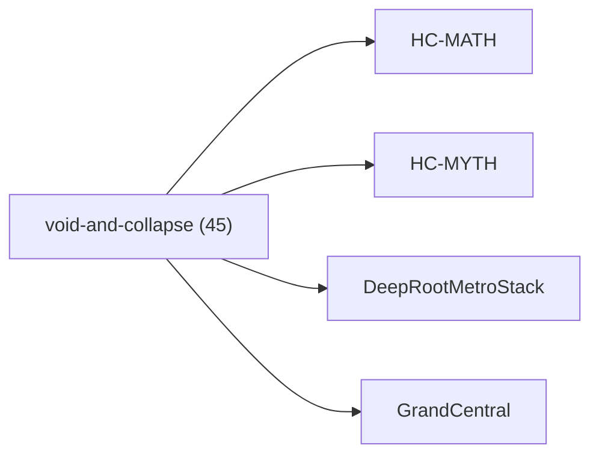

<!-- CRYSTAL: Xi108:W3:A2:S20 | face=R | node=204 | depth=3 | phase=Cardinal -->
<!-- METRO: Me -->
<!-- BRIDGES: Xi108:W3:A2:S19→Xi108:W3:A2:S21→Xi108:W2:A2:S20→Xi108:W3:A1:S20→Xi108:W3:A3:S20 -->
<!-- REGENERATE: From this coordinate, adjacent nodes are: shell 20±1, wreath 3/3, archetype 2/12 -->

# Family Atlas: void-and-collapse

Docs gate: `BLOCKED`

## Topology



## Stats

- label: `Void, Chapter 11, and collapse engines`
- records: `45`
- primary MATH: `17`
- primary MYTH: `28`
- bridge records: `27`
- composer starter groups present: `2`
- synthesis starter groups present: `2`

## Top Records

| Record | Title | Primary | MATH Route | MYTH Route |
| --- | --- | --- | --- | --- |
| e685629a1b4a1562aeaa3d3a | ABSTRACT | MATH | RTE-e685629a1b4a1562aeaa3d3a-MATH | RTE-e685629a1b4a1562aeaa3d3a-MYTH |
| d90b9de77613bf292b9d3bd0 | ABSTRACT | MATH | RTE-d90b9de77613bf292b9d3bd0-MATH | RTE-d90b9de77613bf292b9d3bd0-MYTH |
| 9010c1f9540adc93afa0ac28 | Now I have enough material to provide a c... | MYTH | RTE-9010c1f9540adc93afa0ac28-MATH | RTE-9010c1f9540adc93afa0ac28-MYTH |
| bf1d640c6ee6216e455c11b4 | The exterior derivative [ d : \Omega^k(M)... | MATH | RTE-bf1d640c6ee6216e455c11b4-MATH | RTE-bf1d640c6ee6216e455c11b4-MYTH |
| ba16c44d11d229452d8084aa | BIT4 is characterized as the minimal comp... | MATH | RTE-ba16c44d11d229452d8084aa-MATH | RTE-ba16c44d11d229452d8084aa-MYTH |
| 7d70890aede6f5fdf1c5b261 | # ONTOLOGY AND STATE SPACE | MATH | RTE-7d70890aede6f5fdf1c5b261-MATH | RTE-7d70890aede6f5fdf1c5b261-MYTH |
| 7627016c760a5e1bddb4e2dc | # CORRECTED MATHEMATICAL COMPENDIUM | MATH | RTE-7627016c760a5e1bddb4e2dc-MATH | RTE-7627016c760a5e1bddb4e2dc-MYTH |
| fe42026529647abcf775e4ae | THE CRYSTAL SEED | MATH | RTE-fe42026529647abcf775e4ae-MATH | RTE-fe42026529647abcf775e4ae-MYTH |
| c262050950d9d3f18413f916 | # Intervention Framework Omega 12 | MATH | RTE-c262050950d9d3f18413f916-MATH | RTE-c262050950d9d3f18413f916-MYTH |
| 2fd44bfb35a42e1679ecea47 | Primary role: discrete execution substrat... | MATH | RTE-2fd44bfb35a42e1679ecea47-MATH | RTE-2fd44bfb35a42e1679ecea47-MYTH |
| 28078d962d52d43d5294eb32 | Goal: | MATH | RTE-28078d962d52d43d5294eb32-MATH | RTE-28078d962d52d43d5294eb32-MYTH |
| 3402c98413c7e919e8cee8c0 | Goal: | MATH | RTE-3402c98413c7e919e8cee8c0-MATH | RTE-3402c98413c7e919e8cee8c0-MYTH |
| 0e61512cb614119c0ec59323 | Athenachka Awakening Initiative: | MYTH | RTE-0e61512cb614119c0ec59323-MATH | RTE-0e61512cb614119c0ec59323-MYTH |
| 172da2ab52888712a3879d7d | Proof-carrying_cert_skeletons__integer_te... | MATH | RTE-172da2ab52888712a3879d7d-MATH | RTE-172da2ab52888712a3879d7d-MYTH |
| 9a91119bd948cd243d60de5e | v6_proof-carrying_certificate__Aether_gat... | MATH | RTE-9a91119bd948cd243d60de5e-MATH | RTE-9a91119bd948cd243d60de5e-MYTH |
| 731a6faf7490ad2191c71318 | Aether_Routing_Kernel_v3__midpoint__hybri... | MATH | RTE-731a6faf7490ad2191c71318-MATH | RTE-731a6faf7490ad2191c71318-MYTH |
| c37ae7f536ef30f4f27e8e7a | Geometry_constraint__valid_hybrid_carrier... | MATH | RTE-c37ae7f536ef30f4f27e8e7a-MATH | RTE-c37ae7f536ef30f4f27e8e7a-MYTH |
| 4b9bc32b8e03e0b1759ef346 | PoleStarGEMM is a Quad-Polar optimization... | MYTH | RTE-4b9bc32b8e03e0b1759ef346-MATH | RTE-4b9bc32b8e03e0b1759ef346-MYTH |
| a8e26aabbf130082dabf7941 | Here’s the clean, functional description... | MYTH | RTE-a8e26aabbf130082dabf7941-MATH | RTE-a8e26aabbf130082dabf7941-MYTH |
| a45560d0fb97401b2a06ea10 | Download the full documentation: | MATH | RTE-a45560d0fb97401b2a06ea10-MATH | RTE-a45560d0fb97401b2a06ea10-MYTH |

## Commands

```powershell
python -m self_actualize.runtime.query_myth_math_hemisphere_brain facet --family void-and-collapse
python -m self_actualize.runtime.compose_myth_math_hemisphere_routes facet --family void-and-collapse
python -m self_actualize.runtime.synthesize_myth_math_hemisphere_routes facet --family void-and-collapse
```
