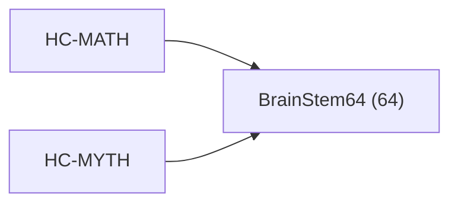

<!-- CRYSTAL: Xi108:W3:A6:S24 | face=R | node=294 | depth=3 | phase=Cardinal -->
<!-- METRO: Me -->
<!-- BRIDGES: Xi108:W3:A6:S23→Xi108:W3:A6:S25→Xi108:W2:A6:S24→Xi108:W3:A5:S24→Xi108:W3:A7:S24 -->
<!-- REGENERATE: From this coordinate, adjacent nodes are: shell 24±1, wreath 3/3, archetype 6/12 -->

# Target-System Atlas: BrainStem64

Docs gate: `BLOCKED`

## Topology



## Family Mix

| Family | Records |
| --- | --- |
| manuscript-architecture | 64 |

## Top Records

| Record | Title | MATH Target | MYTH Target |
| --- | --- | --- | --- |
| a2a80524558fe524a1d4ab20 | Bulk⊕Boundary totalization law. Each such... | BrainStem64 | L2DeepEmergence |
| 3e52a6e32a4dd7a1013f5bd6 | (C) Holographic Rotation as a representat... | BrainStem64 | L2DeepEmergence |
| 3b41498ef41c47272fa483de | THE ALGEBRA OF SOLAR SYSTEM INTELLIGENCE | BrainStem64 | L2DeepEmergence |
| e9e1c8e4c771fdf15a2ef73d | THE LIMINAL TOWER | BrainStem64 | L2DeepEmergence |
| c8b055cb3668495979f1f114 | To make this precise, the manuscript intr... | BrainStem64 | L2DeepEmergence |
| 2f872be4e38e165d15d33327 | The Master Tome is not a linear narrative... | BrainStem64 | L2DeepEmergence |
| 34f5f4a406e1b1a3899b594d | LM TOME I — FOUNDATIONS & SEMANTICS | BrainStem64 | L2DeepEmergence |
| f1222c323cc5d20b6bd54b77 | LM TOME III — INFORMATION & RENORMALIZATI... | BrainStem64 | L2DeepEmergence |
| fda896096ae74ad71bf9631f | SKELETON OUTLINE: THE $4^4$ CRYSTAL STRUC... | BrainStem64 | L2DeepEmergence |
| e9a5891d0d8d8c52c939c623 | At the level of domain instantiations, th... | BrainStem64 | L2DeepEmergence |
| a361c24ad31475727faf40c3 | Classical computational practice conflate... | BrainStem64 | L2DeepEmergence |
| 80e1556b76a5197e6d91fce1 | ABSTRACT | BrainStem64 | L2DeepEmergence |
| b5b28fc8f0522ae8dcc9b510 | THE FRACTAL CRYSTAL TREATISE | BrainStem64 | L2DeepEmergence |
| 1476947c4416d75da338d7f3 | This manuscript builds a single, unified... | BrainStem64 | L2DeepEmergence |
| c42cbaf05111068799b2bce3 | # Source Ledger | BrainStem64 | L2DeepEmergence |
| 1dcb8dcfea9fc2ab0587e8ad | LM TOME IV — MECHANIZATION & IMPLEMENTATI... | BrainStem64 | L2DeepEmergence |
| e88e534461562bd46b39af1f | BASE MAPS (NORMATIVE) | BrainStem64 | L2DeepEmergence |
| 8093ae970d8cbcf0036b4b64 | The total of 256 expressions is derived f... | BrainStem64 | L2DeepEmergence |
| 11133b459e3390f8cb02cff9 | QUANTUMLANG | BrainStem64 | L2DeepEmergence |
| aeaff97e03651975d5a6b173 | ABSTRACT CONTRACT / LEGEND | BrainStem64 | L2DeepEmergence |

## Commands

```powershell
python -m self_actualize.runtime.query_myth_math_hemisphere_brain record --record-id <record_id>
python -m self_actualize.runtime.compose_myth_math_hemisphere_routes record --record-id <record_id>
python -m self_actualize.runtime.synthesize_myth_math_hemisphere_routes record --record-id <record_id>
```
