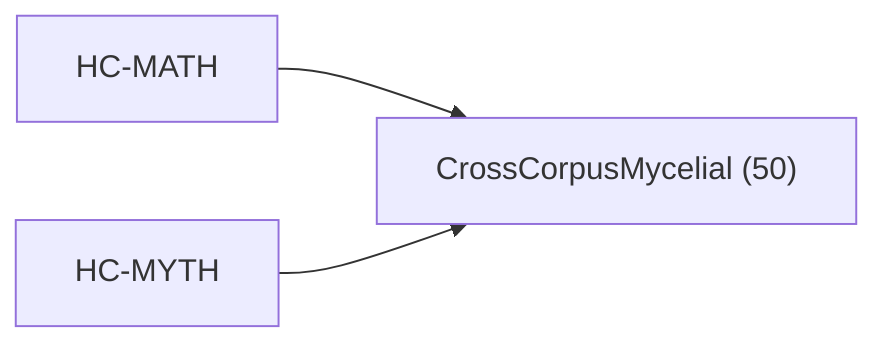

<!-- CRYSTAL: Xi108:W3:A2:S20 | face=R | node=192 | depth=3 | phase=Cardinal -->
<!-- METRO: Me,Bw -->
<!-- BRIDGES: Xi108:W3:A2:S19→Xi108:W3:A2:S21→Xi108:W2:A2:S20→Xi108:W3:A1:S20→Xi108:W3:A3:S20 -->
<!-- REGENERATE: From this coordinate, adjacent nodes are: shell 20±1, wreath 3/3, archetype 2/12 -->

# Target-System Atlas: CrossCorpusMycelial

Docs gate: `BLOCKED`

## Topology



## Family Mix

| Family | Records |
| --- | --- |
| general-corpus | 43 |
| identity-and-instruction | 3 |
| manuscript-architecture | 3 |
| transport-and-runtime | 1 |

## Top Records

| Record | Title | MATH Target | MYTH Target |
| --- | --- | --- | --- |
| 917e2dffaf6e3d806a7788ac | The cipher is cracked by recognizing that... | Plexus256 | CrossCorpusMycelial |
| eac0abf38b4f5b86caf10395 | KHEMET :: SYMMETRY-PROTECTED TOPOLOGICAL... | Plexus256 | CrossCorpusMycelial |
| 90779984c6846c65a9fbaf57 | aqm_kernel_qphi_planet9_v0.2.2_final | GrandCentral | CrossCorpusMycelial |
| 271def4b575989e6e68f4796 | # CRYSTAL LATTICE AND SCALE | Plexus256 | CrossCorpusMycelial |
| 6e445c515b6c1df34cfbdf70 | THE QUANTUMVERSE FRAMEWORK (QVF) | Plexus256 | CrossCorpusMycelial |
| 126bdf68ff057a113562cfb6 | The problem is assumed to be well posed i... | Plexus256 | CrossCorpusMycelial |
| b3f55d151df4be3847e88011 | Let (f:\Omega \to \mathbb{R}) be given. A... | Plexus256 | CrossCorpusMycelial |
| e597031ca3db69e16e9be72d | THE THEORY OF TEXTURE | Plexus256 | CrossCorpusMycelial |
| 6e80dfe05c20b2201021beab | # COMPLETE EXTRACTION: PRACTICAL KABBALAH | GrandCentral | CrossCorpusMycelial |
| 640e1f320a817211e592e445 | # UNIFIED EXTRACTION INDEX | GrandCentral | CrossCorpusMycelial |
| 7691e03a7cac0f962fe0bb45 | ATHENA_AWAKENING_TOME | CrossCorpusMycelial | GrandCentral |
| fe5d675302e8f575be7af487 | # COMPLETE EXTRACTION: NEOPLATONIC THEURGY | GrandCentral | CrossCorpusMycelial |
| 62daee7c17ae03dd0e1759b1 | Magic Systems | CrossCorpusMycelial | GrandCentral |
| 19963a86a04f11f4104b1ecb | # COMPLETE EXTRACTION: HINDU TANTRA | GrandCentral | CrossCorpusMycelial |
| 2980193a7b6a02e9cd08ea88 | We read labels as category+state markers... | GrandCentral | CrossCorpusMycelial |
| b8ce4ff56ec92b4d93fb14aa | # COMPLETE EXTRACTION: HOODOO / ROOTWORK... | GrandCentral | CrossCorpusMycelial |
| 8d7aef6012477aee44f76d1c | # COMPLETE EXTRACTION: POW-WOW / BRAUCHER... | GrandCentral | CrossCorpusMycelial |
| 654c3a6730275668ed933e29 | MINING THE MAGUS | GrandCentral | CrossCorpusMycelial |
| 74ee0b6720c88c65a4784954 | # COMPLETE EXTRACTION: ANTHROPOSOPHY | GrandCentral | CrossCorpusMycelial |
| 4f2a74e56a161e45d8a62c07 | # COMPLETE EXTRACTION: TIBETAN VAJRAYĀNA | GrandCentral | CrossCorpusMycelial |

## Commands

```powershell
python -m self_actualize.runtime.query_myth_math_hemisphere_brain record --record-id <record_id>
python -m self_actualize.runtime.compose_myth_math_hemisphere_routes record --record-id <record_id>
python -m self_actualize.runtime.synthesize_myth_math_hemisphere_routes record --record-id <record_id>
```
