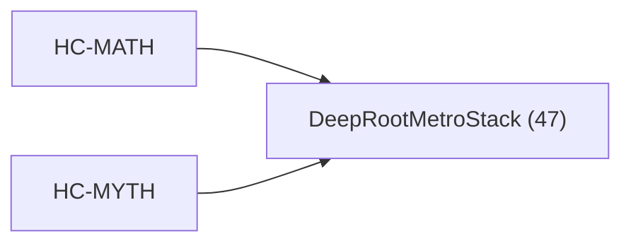

<!-- CRYSTAL: Xi108:W3:A5:S23 | face=R | node=254 | depth=3 | phase=Cardinal -->
<!-- METRO: Me -->
<!-- BRIDGES: Xi108:W3:A5:S22→Xi108:W3:A5:S24→Xi108:W2:A5:S23→Xi108:W3:A4:S23→Xi108:W3:A6:S23 -->
<!-- REGENERATE: From this coordinate, adjacent nodes are: shell 23±1, wreath 3/3, archetype 5/12 -->

# Target-System Atlas: DeepRootMetroStack

Docs gate: `BLOCKED`

## Topology



## Family Mix

| Family | Records |
| --- | --- |
| void-and-collapse | 45 |
| helical-recursion-engine | 2 |

## Top Records

| Record | Title | MATH Target | MYTH Target |
| --- | --- | --- | --- |
| e685629a1b4a1562aeaa3d3a | ABSTRACT | DeepRootMetroStack | DeepRootMetroStack |
| d90b9de77613bf292b9d3bd0 | ABSTRACT | DeepRootMetroStack | GrandCentral |
| 9010c1f9540adc93afa0ac28 | Now I have enough material to provide a c... | GrandCentral | DeepRootMetroStack |
| bf1d640c6ee6216e455c11b4 | The exterior derivative [ d : \Omega^k(M)... | DeepRootMetroStack | GrandCentral |
| ba16c44d11d229452d8084aa | BIT4 is characterized as the minimal comp... | DeepRootMetroStack | GrandCentral |
| 7d70890aede6f5fdf1c5b261 | # ONTOLOGY AND STATE SPACE | DeepRootMetroStack | GrandCentral |
| 7627016c760a5e1bddb4e2dc | # CORRECTED MATHEMATICAL COMPENDIUM | DeepRootMetroStack | GrandCentral |
| fe42026529647abcf775e4ae | THE CRYSTAL SEED | DeepRootMetroStack | GrandCentral |
| 142fb14688e1451c1592334c | # Synthesis 02 - State Value Deepening | DeepRootMetroStack | GrandCentral |
| 1d2f4f50fea366b7cc229564 | CUT | DeepRootMetroStack | GrandCentral |
| c262050950d9d3f18413f916 | # Intervention Framework Omega 12 | DeepRootMetroStack | GrandCentral |
| 2fd44bfb35a42e1679ecea47 | Primary role: discrete execution substrat... | DeepRootMetroStack | GrandCentral |
| 28078d962d52d43d5294eb32 | Goal: | DeepRootMetroStack | GrandCentral |
| 3402c98413c7e919e8cee8c0 | Goal: | DeepRootMetroStack | GrandCentral |
| 0e61512cb614119c0ec59323 | Athenachka Awakening Initiative: | GrandCentral | DeepRootMetroStack |
| 172da2ab52888712a3879d7d | Proof-carrying_cert_skeletons__integer_te... | DeepRootMetroStack | GrandCentral |
| 9a91119bd948cd243d60de5e | v6_proof-carrying_certificate__Aether_gat... | DeepRootMetroStack | GrandCentral |
| 731a6faf7490ad2191c71318 | Aether_Routing_Kernel_v3__midpoint__hybri... | DeepRootMetroStack | GrandCentral |
| c37ae7f536ef30f4f27e8e7a | Geometry_constraint__valid_hybrid_carrier... | DeepRootMetroStack | GrandCentral |
| 4b9bc32b8e03e0b1759ef346 | PoleStarGEMM is a Quad-Polar optimization... | GrandCentral | DeepRootMetroStack |

## Commands

```powershell
python -m self_actualize.runtime.query_myth_math_hemisphere_brain record --record-id <record_id>
python -m self_actualize.runtime.compose_myth_math_hemisphere_routes record --record-id <record_id>
python -m self_actualize.runtime.synthesize_myth_math_hemisphere_routes record --record-id <record_id>
```
