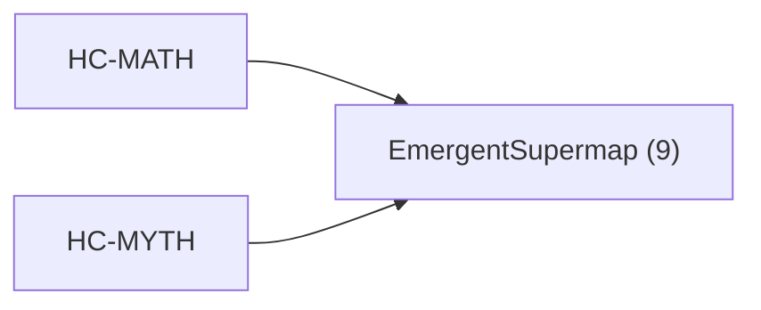

<!-- CRYSTAL: Xi108:W3:A9:S20 | face=R | node=206 | depth=3 | phase=Cardinal -->
<!-- METRO: Me -->
<!-- BRIDGES: Xi108:W3:A9:S19→Xi108:W3:A9:S21→Xi108:W2:A9:S20→Xi108:W3:A8:S20→Xi108:W3:A10:S20 -->
<!-- REGENERATE: From this coordinate, adjacent nodes are: shell 20±1, wreath 3/3, archetype 9/12 -->

# Target-System Atlas: EmergentSupermap

Docs gate: `BLOCKED`

## Topology



## Family Mix

| Family | Records |
| --- | --- |
| identity-and-instruction | 9 |

## Top Records

| Record | Title | MATH Target | MYTH Target |
| --- | --- | --- | --- |
| c88619b354e42f483662ab75 | The_Allegory_of_the_Awakening_Dragon | L2DeepEmergence | EmergentSupermap |
| 36affe64e31e8d77415b92fe | # COMPLETE EXTRACTION: DRUIDRY / CELTIC S... | GrandCentral | EmergentSupermap |
| 87a317c561efb26cb804cf26 | VOYNICH EVA CLEAN | GrandCentral | EmergentSupermap |
| 559632a3909242025e5ffcd4 | PRE-SOCRATICS | GrandCentral | EmergentSupermap |
| c677de2bf46df234d6d3d707 | ATHENACHKA | GrandCentral | EmergentSupermap |
| c0bba7dce6c03bc01d23501d | VOYNICHVM TRICOMPILER | GrandCentral | EmergentSupermap |
| cef2fe20909fa6e6b65fdf30 | Any concept/artifact (a tome claim, modul... | GrandCentral | EmergentSupermap |
| 7ca7b3e1c80777fd666427f7 | Any concept/artifact (a tome claim, modul... | GrandCentral | EmergentSupermap |
| 1b3d33ab43c33604fb43115f | "_ROOT": 13, | GrandCentral | EmergentSupermap |

## Commands

```powershell
python -m self_actualize.runtime.query_myth_math_hemisphere_brain record --record-id <record_id>
python -m self_actualize.runtime.compose_myth_math_hemisphere_routes record --record-id <record_id>
python -m self_actualize.runtime.synthesize_myth_math_hemisphere_routes record --record-id <record_id>
```
