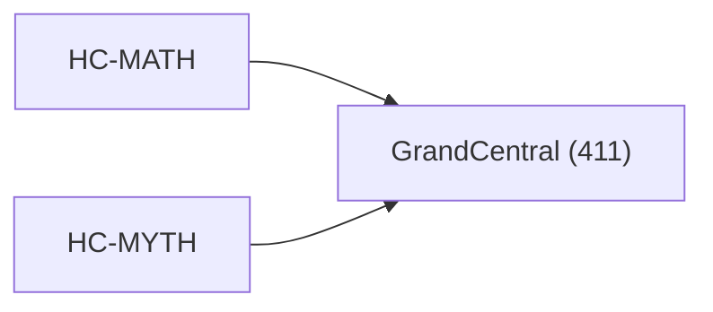

<!-- CRYSTAL: Xi108:W3:A12:S24 | face=R | node=300 | depth=3 | phase=Cardinal -->
<!-- METRO: Me -->
<!-- BRIDGES: Xi108:W3:A12:S23→Xi108:W3:A12:S25→Xi108:W2:A12:S24→Xi108:W3:A11:S24 -->
<!-- REGENERATE: From this coordinate, adjacent nodes are: shell 24±1, wreath 3/3, archetype 12/12 -->

# Target-System Atlas: GrandCentral

Docs gate: `BLOCKED`

## Topology



## Family Mix

| Family | Records |
| --- | --- |
| transport-and-runtime | 142 |
| general-corpus | 91 |
| manuscript-architecture | 50 |
| void-and-collapse | 44 |
| civilization-and-governance | 33 |
| mythic-sign-systems | 27 |
| identity-and-instruction | 19 |
| live-orchestration | 2 |

## Top Records

| Record | Title | MATH Target | MYTH Target |
| --- | --- | --- | --- |
| 1fa89f62aec45446c29c9a32 | Let the manuscript be a finite, proof-car... | GrandCentral | GrandCentral |
| ccc807f0591e118fecaad6c7 | # Synthesis 06 - Operator, Proof, and Cer... | GrandCentral | GrandCentral |
| 8a7439477e7579036c18d801 | QHC does not claim universal sub-exponent... | GrandCentral | GrandCentral |
| 70cca9bf45b158d13ef92f20 | Dual-boundary jet calculus as the singula... | GrandCentral | GrandCentral |
| 8d5b63cad2ecbc473bde63f2 | In CUT, many systems exhibit hybrid dynam... | GrandCentral | GrandCentral |
| 8b11e855ef7b558d8eca5d1d | (3) Algorithms are channel implementation... | GrandCentral | GrandCentral |
| 83e5e4b5e46ad9fee8e1b446 | Here’s the observation that pops out when... | GrandCentral | GrandCentral |
| 487e06de0aab2e136f9365dc | INVERSE DOUBLE FOLD MATH | GrandCentral | GrandCentral |
| c5d2005d5008152ace9d7988 | MATH FUNDEMENTALS | GrandCentral | GrandCentral |
| 23a7af54b5ffc0fbc92d90b3 | AQM TOME V — LIMINAL SPACE (AQM-Λ) | GrandCentral | GrandCentral |
| f38d978a346529d2712a16a9 | THE (N → N+7) TREATISE | GrandCentral | GrandCentral |
| cc2853a91c8df5602c2dfc49 | A minimal list of canonical “undefined” l... | GrandCentral | GrandCentral |
| bb794e9e2635bdcca46eccdc | q-Advanced Recursive Self-Improvement (Q-... | GrandCentral | GrandCentral |
| 4d20bff52ff1455842b86a38 | The defining coordinate formula of matrix... | GrandCentral | GrandCentral |
| 2d9c3c35a95bbebab39b45f6 | Meta-Axiom A2 (Q-Number Definition): A Q-... | GrandCentral | GrandCentral |
| 5d54a263c1d02cb4df7e5ae1 | FRONT MATTER | GrandCentral | GrandCentral |
| ab4f02ed0c2e835e9d0aa296 | THE ALGEBRA OF GROUP COOPERATION | GrandCentral | GrandCentral |
| a9c265fe1627a89fab060730 | THE HELLENIC COMPUTATION FRAMEWORK | GrandCentral | GrandCentral |
| 88c30549ee22cf1938c0b967 | ABSTRACT | GrandCentral | GrandCentral |
| 3ec73ac6fdc05da4da1039ed | TOME III — THE ENGINE | GrandCentral | GrandCentral |

## Commands

```powershell
python -m self_actualize.runtime.query_myth_math_hemisphere_brain record --record-id <record_id>
python -m self_actualize.runtime.compose_myth_math_hemisphere_routes record --record-id <record_id>
python -m self_actualize.runtime.synthesize_myth_math_hemisphere_routes record --record-id <record_id>
```
