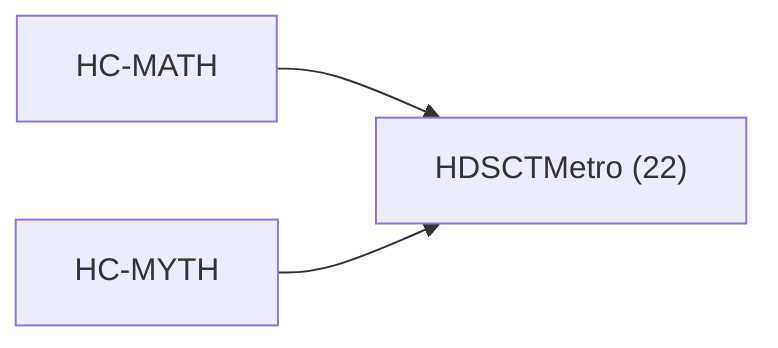

<!-- CRYSTAL: Xi108:W3:A6:S24 | face=R | node=294 | depth=3 | phase=Cardinal -->
<!-- METRO: Me -->
<!-- BRIDGES: Xi108:W3:A6:S23→Xi108:W3:A6:S25→Xi108:W2:A6:S24→Xi108:W3:A5:S24→Xi108:W3:A7:S24 -->
<!-- REGENERATE: From this coordinate, adjacent nodes are: shell 24±1, wreath 3/3, archetype 6/12 -->

# Target-System Atlas: HDSCTMetro

Docs gate: `BLOCKED`

## Topology



## Family Mix

| Family | Records |
| --- | --- |
| higher-dimensional-geometry | 22 |

## Top Records

| Record | Title | MATH Target | MYTH Target |
| --- | --- | --- | --- |
| 91dcd8363965ce318d8f5cbd | Here’s the clean synthesis, in the same r... | HDSCTMetro | HDSCTMetro |
| 791f52591a310c60b200d711 | CRYSTAL COMPUTING FRAMEWORK | HDSCTMetro | HDSCTMetro |
| 58cd47bb4fca4ab274589699 | THE ALGEBRA OF DIFFERENTIATED COOPERATION | HDSCTMetro | HDSCTMetro |
| 2fb3a0158116bc7661c4f103 | THE ALGEBRA OF GLOBAL SYMBIOSIS | HDSCTMetro | HDSCTMetro |
| a1f5d2df5b3879acef7c2bb4 | The Power-to-Gene Ratio acts as a fundame... | HDSCTMetro | HDSCTMetro |
| 8087eef39b5027f56843fa7e | Every nonzero (\psi) has polar form:[\psi... | HDSCTMetro | HDSCTMetro |
| 174d49ab234a8dce5f58c2ad | This section motivates the treatise by tr... | HDSCTMetro | HDSCTMetro |
| 52c48c5cf52ae4d06ba32f0f | A topological manifold of dimension (n \i... | HDSCTMetro | HDSCTMetro |
| be030cd8418b1fb3a347c830 | In applications, (u(t,x)) often represent... | HDSCTMetro | HDSCTMetro |
| 68ca1df9d78d72225bafde02 | TREATISE TITLE: TAWANTINSUYU | HDSCTMetro | HDSCTMetro |
| a8180fc66bde105fff781a73 | EXTENDED MATHEMATICAL FOUNDATIONS | HDSCTMetro | HDSCTMetro |
| 431be588453d5f28803d1957 | WHAT THIS DOES: | HDSCTMetro | HDSCTMetro |
| 75218a5d5c94e493ee59c229 | Let (x\in\mathcal{X}) be a finite signal... | HDSCTMetro | HDSCTMetro |
| 6220bdfbbbd996cfab8c8515 | This script answers questions like: | HDSCTMetro | HDSCTMetro |
| 7134bee13e102f517f77610f | # Ch11<0022> - Quantum Spring: Emergent S... | HDSCTMetro | HDSCTMetro |
| 5a1c435e26b7fac6e5e2cc43 | MATH GOD!! | HDSCTMetro | HDSCTMetro |
| 7dce22c3386f3aee3ba9b9e8 | class SimVisionStack(nn.Module): | HDSCTMetro | HDSCTMetro |
| f63ce393a7cedafc6b254169 | This script is meant to detect: | HDSCTMetro | HDSCTMetro |
| 05abe8b0a4595276058324f8 | # Abstract And Thesis | HDSCTMetro | HDSCTMetro |
| b04d4b0936e771fdc7e50e0a | ABSTRACT | HDSCTMetro | HDSCTMetro |

## Commands

```powershell
python -m self_actualize.runtime.query_myth_math_hemisphere_brain record --record-id <record_id>
python -m self_actualize.runtime.compose_myth_math_hemisphere_routes record --record-id <record_id>
python -m self_actualize.runtime.synthesize_myth_math_hemisphere_routes record --record-id <record_id>
```
