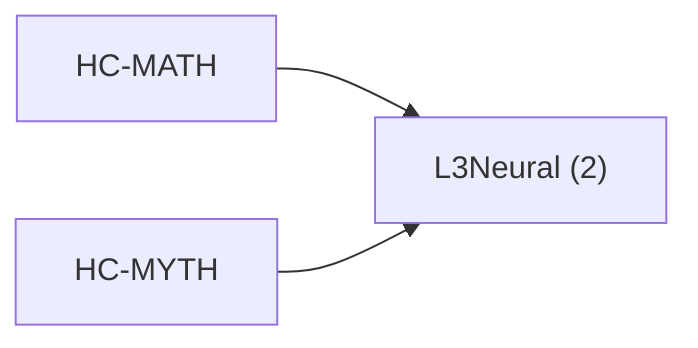

<!-- CRYSTAL: Xi108:W3:A4:S22 | face=R | node=233 | depth=3 | phase=Cardinal -->
<!-- METRO: Me -->
<!-- BRIDGES: Xi108:W3:A4:S21→Xi108:W3:A4:S23→Xi108:W2:A4:S22→Xi108:W3:A3:S22→Xi108:W3:A5:S22 -->
<!-- REGENERATE: From this coordinate, adjacent nodes are: shell 22±1, wreath 3/3, archetype 4/12 -->

# Target-System Atlas: L3Neural

Docs gate: `BLOCKED`

## Topology



## Family Mix

| Family | Records |
| --- | --- |
| live-orchestration | 2 |

## Top Records

| Record | Title | MATH Target | MYTH Target |
| --- | --- | --- | --- |
| 2a6d682e0889b1ecc5b60011 | Always On: HPC tasks typically run 24/7 (... | L3Neural | GrandCentral |
| a43c1d991769591908a4ae82 | Meltdown means a task or service that dem... | L3Neural | GrandCentral |

## Commands

```powershell
python -m self_actualize.runtime.query_myth_math_hemisphere_brain record --record-id <record_id>
python -m self_actualize.runtime.compose_myth_math_hemisphere_routes record --record-id <record_id>
python -m self_actualize.runtime.synthesize_myth_math_hemisphere_routes record --record-id <record_id>
```
