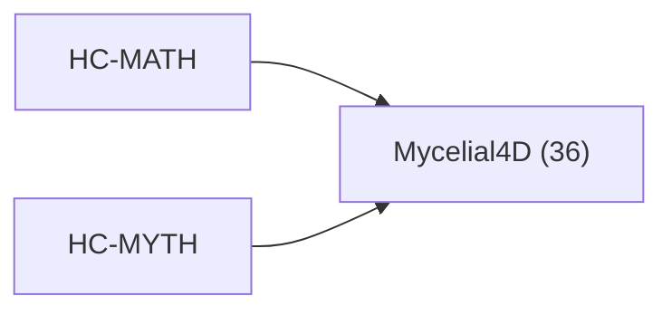

<!-- CRYSTAL: Xi108:W3:A6:S24 | face=R | node=282 | depth=3 | phase=Cardinal -->
<!-- METRO: Me -->
<!-- BRIDGES: Xi108:W3:A6:S23→Xi108:W3:A6:S25→Xi108:W2:A6:S24→Xi108:W3:A5:S24→Xi108:W3:A7:S24 -->
<!-- REGENERATE: From this coordinate, adjacent nodes are: shell 24±1, wreath 3/3, archetype 6/12 -->

# Target-System Atlas: Mycelial4D

Docs gate: `BLOCKED`

## Topology



## Family Mix

| Family | Records |
| --- | --- |
| mythic-sign-systems | 36 |

## Top Records

| Record | Title | MATH Target | MYTH Target |
| --- | --- | --- | --- |
| 2b04e5bd2ba98350aa7569cf | # COMPLETE EXTRACTION: WESTERN ALCHEMY | Mycelial4D | Mycelial4D |
| ffa69c7eaafcdf221098fb0d | # COMPLETE EXTRACTION: IFÁ DIVINATION SYS... | Mycelial4D | Mycelial4D |
| 7c5796f2daa55dfead1dd845 | # COMPLETE EXTRACTION: NORSE RUNIC MAGIC | Mycelial4D | Mycelial4D |
| a5b45456a58570f77b18aa2b | # COMPLETE EXTRACTION: HERMETIC QABALAH | Mycelial4D | Mycelial4D |
| ad2f03af15c6c714c6abc811 | # COMPLETE EXTRACTION: SOLOMONIC MAGIC | Mycelial4D | Mycelial4D |
| e4bc8fdb6c632b84be30108c | # COMPLETE EXTRACTION: GREEK MAGICAL PAPY... | Mycelial4D | Mycelial4D |
| 55c93c42ab3e67ef9bac6b72 | # COMPLETE EXTRACTION: CORE SHAMANISM | Mycelial4D | Mycelial4D |
| 2e0be7a1a18332e3767c5bdb | THE ANDEAN KHIPU ROSETTA STONE | Mycelial4D | Mycelial4D |
| c35964d8dea29459be213fc8 | THE VOYNICH ROSETTA STONE | Mycelial4D | Mycelial4D |
| 28b505d0395f6eda0bec1210 | # COMPLETE EXTRACTION: ENOCHIAN MAGIC | GrandCentral | Mycelial4D |
| 32284e731f8c95f6210066ab | THE ATHENA PROTOCOL (SEED) | GrandCentral | Mycelial4D |
| 65245c16ce4e2d02051903f6 | # GLOSSARY AND SYMBOL TABLE | GrandCentral | Mycelial4D |
| 10913a3aa993b3a96d6d64bf | # COMPLETE EXTRACTION: HERMETICISM | GrandCentral | Mycelial4D |
| ef848ff7e2a6e7e728319ff2 | # COMPLETE EXTRACTION: ROSICRUCIANISM | GrandCentral | Mycelial4D |
| b2ff53da7a40c08dbd9e9ebb | # COMPLETE EXTRACTION: CHAOS MAGIC | GrandCentral | Mycelial4D |
| 47b58c3ae5ed4df82ee40ea6 | \textbf{Proposition 17.1.2 (Boundedness a... | Mycelial4D | GrandCentral |
| c0bd0897bd9b9efbc47711ea | TAROT DECOMPILATION: PHASE I | GrandCentral | Mycelial4D |
| e4d12f7b22cdaef8f8d35212 | # COMPLETE EXTRACTION: MERKAVAH/HEKHALOT... | GrandCentral | Mycelial4D |
| 827d33309253049ecb1f5062 | Q-Phi introduces several groundbreaking a... | Mycelial4D | GrandCentral |
| 21cfd9bbcd9b40d7c6c99812 | CELTIC :THE OGHAM KERNEL | Mycelial4D | GrandCentral |

## Commands

```powershell
python -m self_actualize.runtime.query_myth_math_hemisphere_brain record --record-id <record_id>
python -m self_actualize.runtime.compose_myth_math_hemisphere_routes record --record-id <record_id>
python -m self_actualize.runtime.synthesize_myth_math_hemisphere_routes record --record-id <record_id>
```
