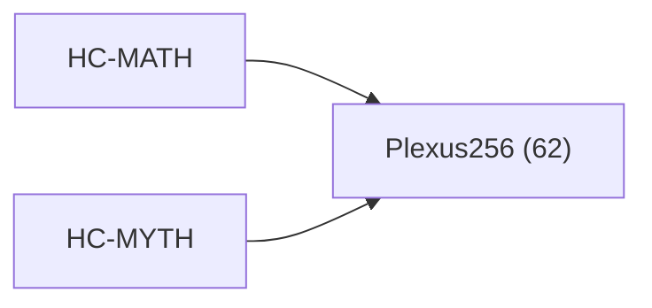

<!-- CRYSTAL: Xi108:W3:A5:S23 | face=R | node=269 | depth=3 | phase=Cardinal -->
<!-- METRO: Me -->
<!-- BRIDGES: Xi108:W3:A5:S22→Xi108:W3:A5:S24→Xi108:W2:A5:S23→Xi108:W3:A4:S23→Xi108:W3:A6:S23 -->
<!-- REGENERATE: From this coordinate, adjacent nodes are: shell 23±1, wreath 3/3, archetype 5/12 -->

# Target-System Atlas: Plexus256

Docs gate: `BLOCKED`

## Topology



## Family Mix

| Family | Records |
| --- | --- |
| general-corpus | 62 |

## Top Records

| Record | Title | MATH Target | MYTH Target |
| --- | --- | --- | --- |
| 917e2dffaf6e3d806a7788ac | The cipher is cracked by recognizing that... | Plexus256 | CrossCorpusMycelial |
| eac0abf38b4f5b86caf10395 | KHEMET :: SYMMETRY-PROTECTED TOPOLOGICAL... | Plexus256 | CrossCorpusMycelial |
| 271def4b575989e6e68f4796 | # CRYSTAL LATTICE AND SCALE | Plexus256 | CrossCorpusMycelial |
| 6e445c515b6c1df34cfbdf70 | THE QUANTUMVERSE FRAMEWORK (QVF) | Plexus256 | CrossCorpusMycelial |
| 126bdf68ff057a113562cfb6 | The problem is assumed to be well posed i... | Plexus256 | CrossCorpusMycelial |
| b3f55d151df4be3847e88011 | Let (f:\Omega \to \mathbb{R}) be given. A... | Plexus256 | CrossCorpusMycelial |
| e597031ca3db69e16e9be72d | THE THEORY OF TEXTURE | Plexus256 | CrossCorpusMycelial |
| 00f75f1789a2a8212b56341e | DEEP CRYSTAL SYNTHESIS | Plexus256 | GrandCentral |
| 67e87b187ed331b7cc8c066b | THE PYRRHONIAN NULL-STATE DRIVER | Plexus256 | GrandCentral |
| 84598346a6c178999926851d | SQUARING THE CIRCLE | Plexus256 | GrandCentral |
| ec6c25531d5cb19b71bbcbef | def test_engine_dense_vs_lowrank(): | Plexus256 | GrandCentral |
| 1be81228f2bfa8ec32919083 | THE RHETORICAL-POETIC OUTPUT DRIVERS | Plexus256 | GrandCentral |
| 0abaa76352c37839e5708243 | THE EPISTEMIC VALIDATION ENGINE | Plexus256 | GrandCentral |
| 85a34289033efa462b6647af | THE CYNIC BLOATWARE REMOVER | Plexus256 | GrandCentral |
| 07703df6eeee193bbf2279c9 | Think of this as starting with a few numb... | Plexus256 | GrandCentral |
| 67dbe61dcd6e9f0bc689bb8a | #!/usr/bin/env python3 | Plexus256 | GrandCentral |
| d4736c4dab21cac1e99ede13 | Checks__proof-ish_invariants_ | Plexus256 | GrandCentral |
| 6e30fb6a4ef0667be83e1b1e | LOGSTACK_2__chart_closure_proof__stable_b... | Plexus256 | GrandCentral |
| 7c8a8309a421b5f516a8a13d | __init__ | Plexus256 | GrandCentral |
| 0dbf0a83c0c511099721a044 | This script can benchmark: | Plexus256 | GrandCentral |

## Commands

```powershell
python -m self_actualize.runtime.query_myth_math_hemisphere_brain record --record-id <record_id>
python -m self_actualize.runtime.compose_myth_math_hemisphere_routes record --record-id <record_id>
python -m self_actualize.runtime.synthesize_myth_math_hemisphere_routes record --record-id <record_id>
```
